# 旧版系统模块协作链路

本文只描述根启动器实际使用的旧版系统，即 `start_modules.py`、
`process_registry.py`、`server/`、`thingking/`、`hearing/`、`speaking/`、
`visual/`、`chatBot/` 和根目录 `tools/` 组成的多进程系统。

`refactoring/thinking/` 是独立的新实现，不在本文链路内。

由于端口号由未提交的 `config.py` 提供，本文统一使用 `ZMQ_PORTS` 中的
符号名，不假设具体端口值。

## 1. 系统总览

旧版系统以 ZeroMQ 为内部消息总线，以 Classification 为输入汇聚点，
以 Thinking 为业务中枢。NapCat WebSocket、HTTP LLM/VLM/TTS 和本地
文件存储是系统边界。

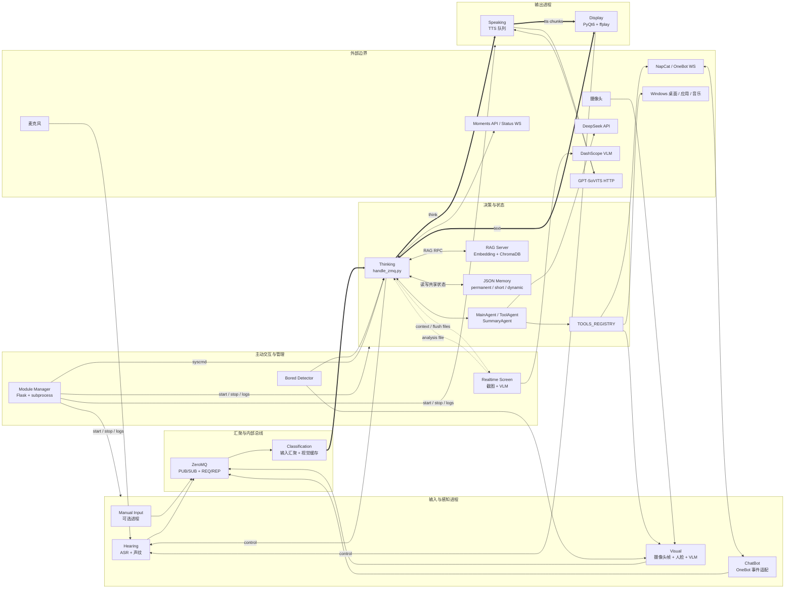
```mermaid
flowchart LR
    subgraph EXTERNAL["外部边界"]
        direction TB
        MIC["麦克风"]
        CAMERA["摄像头"]
        NAPCAT["NapCat / OneBot WS"]
        DEEPSEEK["DeepSeek API"]
        DASHSCOPE["DashScope VLM"]
        GPTSOVITS["GPT-SoVITS HTTP"]
        MOMENTS["Moments API / Status WS"]
        DESKTOP["Windows 桌面 / 应用 / 音乐"]
    end

    subgraph INPUT["输入与感知进程"]
        direction TB
        HEARING["Hearing<br/>ASR + 声纹"]
        CHATBOT["ChatBot<br/>OneBot 事件适配"]
        VISUAL["Visual<br/>摄像头帧 + 人脸 + VLM"]
        MANUAL["Manual Input<br/>可选进程"]
    end

    subgraph BUS["汇聚与内部总线"]
        direction TB
        CLASSIFICATION["Classification<br/>输入汇聚 + 视觉缓存"]
        ZMQ["ZeroMQ<br/>PUB/SUB + REQ/REP"]
    end

    subgraph CORE["决策与状态"]
        direction TB
        THINKING["Thinking<br/>handle_zmq.py"]
        AGENTS["MainAgent / ToolAgent<br/>SummaryAgent"]
        TOOLS["TOOLS_REGISTRY"]
        RAG["RAG Server<br/>Embedding + ChromaDB"]
        MEMORY["JSON Memory<br/>permanent / short / dynamic"]
    end

    subgraph OUTPUT["输出进程"]
        direction TB
        SPEAKING["Speaking<br/>TTS 队列"]
        DISPLAY["Display<br/>PyQt6 + ffplay"]
    end

    subgraph ACTIVE["主动交互与管理"]
        direction TB
        BORED["Bored Detector"]
        SCREEN["Realtime Screen<br/>截图 + VLM"]
        MANAGER["Module Manager<br/>Flask + subprocess"]
    end

    MIC --> HEARING
    CAMERA --> VISUAL
    NAPCAT <--> CHATBOT
    MANUAL --> ZMQ
    HEARING --> ZMQ
    CHATBOT --> ZMQ
    VISUAL --> ZMQ
    ZMQ --> CLASSIFICATION
    CLASSIFICATION ==> THINKING

    THINKING <--> AGENTS
    AGENTS --> TOOLS
    THINKING <-->|"RAG RPC"| RAG
    THINKING <-->|"读写共享状态"| MEMORY
    TOOLS --> DESKTOP
    TOOLS --> NAPCAT
    TOOLS --> VISUAL
    AGENTS --> DEEPSEEK

    THINKING ==>|"text"| DISPLAY
    THINKING ==>|"think"| SPEAKING
    SPEAKING --> GPTSOVITS
    GPTSOVITS --> SPEAKING
    SPEAKING ==>|"tts chunks"| DISPLAY
    DISPLAY -->|"control"| HEARING
    THINKING -->|"control"| HEARING

    BORED --> THINKING
    BORED --> VISUAL
    SCREEN --> DASHSCOPE
    SCREEN -.->|"analysis file"| THINKING
    THINKING -.->|"context / flush files"| SCREEN
    THINKING <--> MOMENTS
    MANAGER -->|"start / stop / logs"| INPUT
    MANAGER -->|"start / stop / logs"| CORE
    MANAGER -->|"start / stop / logs"| OUTPUT
    MANAGER -->|"syscmd"| THINKING
```

图中线型含义：

| 线型 | 含义 |
| --- | --- |
| `==>` | 用户请求或回复的关键主链 |
| `-->` | 普通消息、调用或进程控制 |
| `-.->` | 文件协议，不通过 ZMQ |
| `<-->` | 存在请求与响应，或双向外部连接 |

系统可以分成五个协作面：

| 协作面 | 责任 |
| --- | --- |
| 启动与管理面 | 启停进程、收集日志、清理端口、等待模块就绪 |
| 输入面 | 接收 ASR、手动输入、QQ 消息和视觉信息 |
| 决策面 | 构建人格与记忆上下文，调用主模型、工具模型和摘要模型 |
| 输出面 | 本地文本展示、TTS 播放、QQ 回复 |
| 主动交互面 | 无聊检测、视觉刺激、实时屏幕变化和在线状态 |

## 2. 常驻模块职责

| 模块 | 入口 | 核心责任 | 主要依赖 |
| --- | --- | --- | --- |
| Module Manager | `server/module_manager.py` | Web 管理页、进程启停、日志、工具开关、实时屏幕配置 | Flask、subprocess |
| Classification | `server/classification_server.py` | 汇聚 ASR、手动输入、QQ 和视觉缓存，统一转给 Thinking | ZeroMQ |
| Display | `server/gui_display.py` | 显示角色和文本、播放流式音频、发布播放状态 | PyQt6、ffplay、ZeroMQ |
| Speaking | `speaking/main.py` | 将 Thinking 文本送入 TTS，流式转发音频 | GPT-SoVITS HTTP、ZeroMQ |
| Visual | `visual/0.py` | 维护摄像头帧，按请求做人脸和 VLM 分析 | OpenCV、DashScope VLM |
| RAG Server | `thingking/rag_server.py` | 独立承载 embedding、ChromaDB 和记忆 RPC | LangChain、ChromaDB |
| Hearing | `hearing/1.py` | 麦克风采集、ASR、声纹校验、回声抑制 | FunASR、PyAudio |
| Bored Detector | `thingking/src/bored_detector.py` | 根据时间、关系、上下文和视觉变化触发主动对话 | DeepSeek、共享记忆文件 |
| Thinking | `thingking/src/handle_zmq.py` | 对话、人格、工具调度、记忆、主动交互和输出分发 | DeepSeek、ZeroMQ |
| ChatBot | `chatBot/main.py` | 接收 NapCat 事件并发布 QQ 消息 | NapCat WebSocket |

以下模块不在 `process_registry.py` 的默认九进程列表中：

| 辅助模块 | 启动方式 | 作用 |
| --- | --- | --- |
| Manual Input | 单独运行 `server/manual_input.py` | 从终端发布手动文本 |
| Realtime Screen | Module Manager 按配置拉起 | 定时截图并把 VLM 分析写入文件 |
| RAG Web/Data 工具 | 单独运行 | 查看或维护记忆，不参与主请求链 |

## 3. 启动与就绪握手

### 3.1 Web 模式

`python start_modules.py` 默认只启动 Flask Module Manager，并打开
`http://127.0.0.1:5000`。子服务由管理页调用 `/api/services/start-all`
或单服务启动接口拉起。

### 3.2 Console 模式

`python start_modules.py --console` 会先清理所有配置端口，再按以下顺序
启动独立控制台进程：

1. Classification
2. Display
3. Speaking
4. Visual
5. RAG Server
6. Hearing
7. Bored Detector
8. Thinking
9. ChatBot

两种启动模式的控制关系不同：

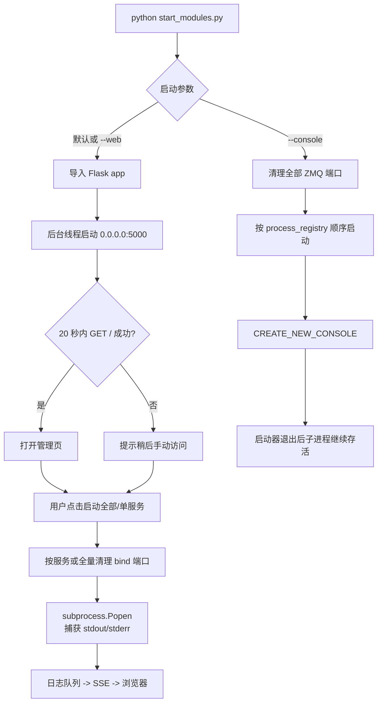
```mermaid
flowchart TB
    START["python start_modules.py"] --> ARGS{"启动参数"}

    ARGS -->|"默认或 --web"| WEB["导入 Flask app"]
    WEB --> WAIT_HTTP["后台线程启动 0.0.0.0:5000"]
    WAIT_HTTP --> PROBE{"20 秒内 GET / 成功?"}
    PROBE -->|是| OPEN["打开管理页"]
    PROBE -->|否| MANUAL_OPEN["提示稍后手动访问"]
    OPEN --> USER_ACTION["用户点击启动全部/单服务"]
    MANUAL_OPEN --> USER_ACTION
    USER_ACTION --> CLEAN_ONE["按服务或全量清理 bind 端口"]
    CLEAN_ONE --> POPEN_WEB["subprocess.Popen<br/>捕获 stdout/stderr"]
    POPEN_WEB --> SSE["日志队列 -> SSE -> 浏览器"]

    ARGS -->|"--console"| CONSOLE["清理全部 ZMQ 端口"]
    CONSOLE --> ORDER["按 process_registry 顺序启动"]
    ORDER --> POPEN_CONSOLE["CREATE_NEW_CONSOLE"]
    POPEN_CONSOLE --> SURVIVE["启动器退出后子进程继续存活"]
```

### 3.3 正式启动握手

启动进程不等于 Thinking 可以立即处理消息。正式握手如下：

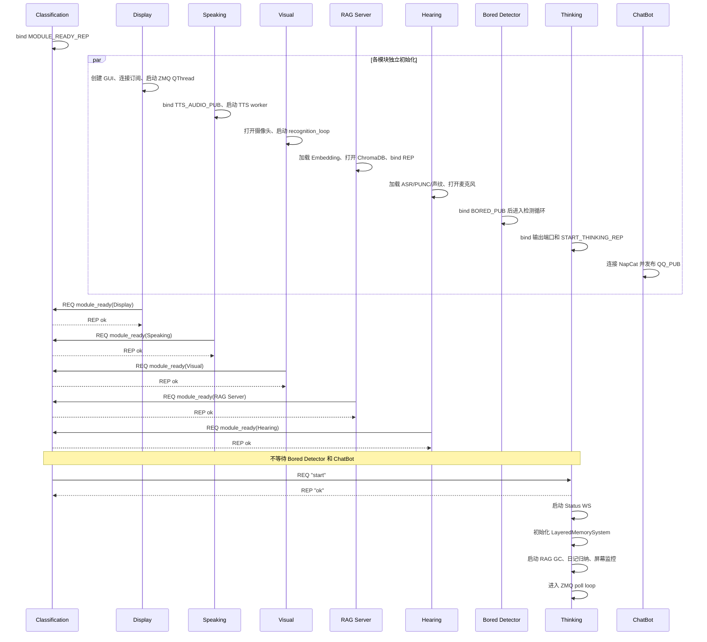
```mermaid
sequenceDiagram
    participant C as Classification
    participant D as Display
    participant S as Speaking
    participant V as Visual
    participant R as RAG Server
    participant H as Hearing
    participant B as Bored Detector
    participant T as Thinking
    participant Q as ChatBot

    C->>C: bind MODULE_READY_REP
    par 各模块独立初始化
        D->>D: 创建 GUI、连接订阅、启动 ZMQ QThread
        S->>S: bind TTS_AUDIO_PUB、启动 TTS worker
        V->>V: 打开摄像头、启动 recognition_loop
        R->>R: 加载 Embedding、打开 ChromaDB、bind REP
        H->>H: 加载 ASR/PUNC/声纹、打开麦克风
        B->>B: bind BORED_PUB 后进入检测循环
        T->>T: bind 输出端口和 START_THINKING_REP
        Q->>Q: 连接 NapCat 并发布 QQ_PUB
    end
    D->>C: REQ module_ready(Display)
    C-->>D: REP ok
    S->>C: REQ module_ready(Speaking)
    C-->>S: REP ok
    V->>C: REQ module_ready(Visual)
    C-->>V: REP ok
    R->>C: REQ module_ready(RAG Server)
    C-->>R: REP ok
    H->>C: REQ module_ready(Hearing)
    C-->>H: REP ok
    Note over C,T: 不等待 Bored Detector 和 ChatBot
    C->>T: REQ "start"
    T-->>C: REP "ok"
    T->>T: 启动 Status WS
    T->>T: 初始化 LayeredMemorySystem
    T->>T: 启动 RAG GC、日记归纳、屏幕监控
    T->>T: 进入 ZMQ poll loop
```

Classification 只等待 Display、Speaking、Visual、RAG Server 和 Hearing。
它不等待 Bored Detector 与 ChatBot。因此：

- 本地语音主链准备好后，Thinking 即可上线。
- ChatBot 启动失败不会阻塞本地语音链。
- 任一被等待模块未上报，会导致 Thinking 一直停在正式启动前。
- 就绪上报是一次性 REQ/REP，没有统一重试编排。

Thinking 自身的启动状态可以概括为：

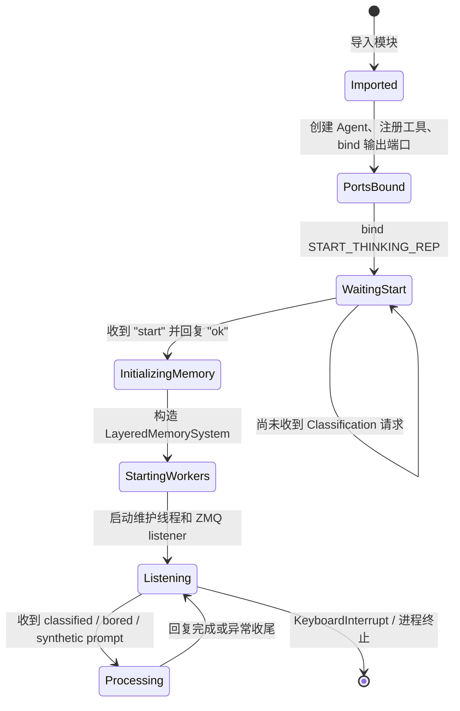
```mermaid
stateDiagram-v2
    [*] --> Imported: 导入模块
    Imported --> PortsBound: 创建 Agent、注册工具、bind 输出端口
    PortsBound --> WaitingStart: bind START_THINKING_REP
    WaitingStart --> WaitingStart: 尚未收到 Classification 请求
    WaitingStart --> InitializingMemory: 收到 "start" 并回复 "ok"
    InitializingMemory --> StartingWorkers: 构造 LayeredMemorySystem
    StartingWorkers --> Listening: 启动维护线程和 ZMQ listener
    Listening --> Processing: 收到 classified / bored / synthetic prompt
    Processing --> Listening: 回复完成或异常收尾
    Listening --> [*]: KeyboardInterrupt / 进程终止
```

## 4. ZMQ 通信矩阵

| 端口符号 | Binder / 服务端 | Connector / 客户端 | Topic 或模式 | 作用 |
| --- | --- | --- | --- | --- |
| `HEARING_ASR_PUB` | Hearing | Classification、Display | `asr` | ASR 文本及录音相关事件 |
| `MANUAL_TEXT_PUB` | Manual Input | Classification | `text` | 手动文本输入 |
| `VISUAL_PUB` | Visual | Classification | `visual` | 最近一次主动视觉分析结果 |
| `VISUAL_REQREP` | Visual REP | Thinking 工具、Bored Detector | REQ/REP | 按需获取当前摄像头分析 |
| `QQ_PUB` | ChatBot | Classification | `qq` | 原始 OneBot/NapCat 事件 |
| `CLASSIFICATION_PUB` | Classification | Thinking | `classified`、`qq_log` | 主请求和未触发回复的 QQ 日志 |
| `THINKING_TEXT_PUB` | Thinking | Display | `text` | 本地展示文本 |
| `THINKING_TTS_PUB` | Thinking | Speaking、Display | `think` | TTS 请求及翻译信息 |
| `TTS_AUDIO_PUB` | Speaking | Display | `tts` | Base64 音频块和流结束信号 |
| `AUDIO_PLAY_PUB` | Thinking | Display | `tts` | sing 工具通过 Thinking 持有的 socket 播放本地音频 |
| `CONTROL_PUB` | Display | Hearing、Thinking | `control` | 播放开始/结束状态 |
| `CONTROL_PUB_THINKING` | Thinking | Hearing | `control` | 思考阶段强制暂停/恢复录音 |
| `RAG_SERVER_REQREP` | RAG Server REP | Thinking、QQ Buffer | REQ/REP | 检索、写入、GC 和数据管理 |
| `BORED_PUB` | Bored Detector | Thinking | `bored` | 主动对话触发 |
| `MODULE_READY_REP` | Classification REP | 五个被等待模块 | REQ/REP | 模块就绪上报 |
| `START_THINKING_REP` | Thinking REP | Classification | REQ/REP | 正式启动通知 |
| 固定 `5566` | Module Manager | Thinking | `syscmd` | 游戏模式与在线状态通知 |

ZeroMQ PUB/SUB 不保存历史消息。发布者刚启动、订阅尚未建立时发送的消息
可能丢失，因此启动顺序和短暂等待对当前实现很重要。

按 socket 所有权展开后的拓扑如下。箭头方向均为消息方向，方框中的
`BIND` 表示端口所有者：

```mermaid
flowchart TB
    subgraph INPUT_PUB["输入 PUB/SUB"]
        H_PUB["Hearing<br/>BIND HEARING_ASR_PUB"]
        M_PUB["Manual Input<br/>BIND MANUAL_TEXT_PUB"]
        Q_PUB["ChatBot<br/>BIND QQ_PUB"]
        V_PUB["Visual<br/>BIND VISUAL_PUB"]
        C_SUB["Classification<br/>CONNECT 四个输入端口"]

        H_PUB -->|"topic: asr"| C_SUB
        M_PUB -->|"topic: text"| C_SUB
        Q_PUB -->|"topic: qq"| C_SUB
        V_PUB -->|"topic: visual"| C_SUB
    end

    subgraph CORE_PUB["汇聚与决策 PUB/SUB"]
        C_PUB["Classification<br/>BIND CLASSIFICATION_PUB"]
        T_SUB["Thinking<br/>CONNECT CLASSIFICATION_PUB"]
        B_PUB["Bored Detector<br/>BIND BORED_PUB"]
        SYS_PUB["Module Manager<br/>BIND fixed 5566"]

        C_PUB -->|"classified / qq_log"| T_SUB
        B_PUB -->|"bored"| T_SUB
        SYS_PUB -->|"syscmd"| T_SUB
    end

    subgraph OUTPUT_PUB["输出 PUB/SUB"]
        T_TEXT["Thinking<br/>BIND THINKING_TEXT_PUB"]
        T_TTS["Thinking<br/>BIND THINKING_TTS_PUB"]
        T_AUDIO["Thinking<br/>BIND AUDIO_PLAY_PUB"]
        S_AUDIO["Speaking<br/>BIND TTS_AUDIO_PUB"]
        D_SUB["Display<br/>CONNECT text / think / tts"]

        T_TEXT -->|"text"| D_SUB
        T_TTS -->|"think"| D_SUB
        T_TTS -->|"think"| S_AUDIO
        S_AUDIO -->|"tts"| D_SUB
        T_AUDIO -->|"tts"| D_SUB
    end

    subgraph CONTROL_PUB["控制 PUB/SUB"]
        D_CTRL["Display<br/>BIND CONTROL_PUB"]
        T_CTRL["Thinking<br/>BIND CONTROL_PUB_THINKING"]
        H_CTRL["Hearing<br/>CONNECT 两个控制端口"]
        T_BUSY["Thinking<br/>CONNECT CONTROL_PUB"]

        D_CTRL -->|"control: start/end"| H_CTRL
        D_CTRL -->|"control: start/end"| T_BUSY
        T_CTRL -->|"control: start/end"| H_CTRL
    end

    subgraph RPC["同步 REQ/REP"]
        READY["Classification<br/>BIND MODULE_READY_REP"]
        START_REP["Thinking<br/>BIND START_THINKING_REP"]
        VIS_REP["Visual<br/>BIND VISUAL_REQREP"]
        RAG_REP["RAG Server<br/>BIND RAG_SERVER_REQREP"]

        MODULES["Display / Speaking / Visual<br/>RAG Server / Hearing"] -->|"REQ ready"| READY
        READY -->|"REQ start"| START_REP
        THINK_REQ["Thinking Tools"] -->|"REQ look"| VIS_REP
        BORED_REQ["Bored Detector"] -->|"REQ look"| VIS_REP
        MEM_REQ["Thinking Memory / QQ Buffer"] -->|"REQ method + params"| RAG_REP
    end
```

同一个 PUB 端口可以有多个订阅者，例如 `THINKING_TTS_PUB` 同时被 Speaking
和 Display 订阅；REQ/REP 则要求严格的一问一答，超时后客户端会关闭当前
REQ socket，下一次调用创建新 socket。

主要消息的最小载荷契约：

| Topic / RPC | 主要字段 | 生产者处理 | 消费者处理 |
| --- | --- | --- | --- |
| `asr` | `user_input`、`sender=ASR` | Hearing 发布识别结果 | Classification 转为统一输入；Display 只处理特殊播放控制事件 |
| `text`（手动输入） | `user_input`、`sender=MANUAL` | Manual Input 发布 | Classification 转为统一输入 |
| `qq` | OneBot 原事件、`_is_mentioned`、`_is_admin`、`_image_urls` | ChatBot 增补内部字段 | Classification 判断触发回复或仅记录 |
| `visual` | `faces`、`objects`、`gestures`、`scene_caption`、`scene_image` | Visual 完成按需分析后广播 | Classification 覆盖最新视觉缓存 |
| `classified` | `user_input`、`img_descr`、`source`、可选 `qq_context` | Classification 统一封装 | Thinking 进入请求调度 |
| `qq_log` | `content`、`sender`、`group_id`、`user_id`、`timestamp` | Classification 生成未 @ 日志 | Thinking 写 QQ Buffer，不触发回复 |
| `bored` | `type`、`timestamp`、可选 `visual_stimulus` | Bored Detector | Thinking 构造主动对话系统事件 |
| `syscmd` | `system_command`、可选 `interval/user_online` | Module Manager | Thinking 更新游戏模式或在线状态 |
| `control` | `cough=start/end` | Thinking 或 Display | Hearing 暂停/恢复；Thinking记录播放器忙碌 |
| RAG RPC | `method`、`params` | Thinking 的轻量 Client | RAG Server 分派到对应存储方法 |
| Ready RPC | `action=module_ready`、`module` | 被等待的五个模块 | Classification 收集模块名并返回 `ok` |

## 5. 本地语音请求主链

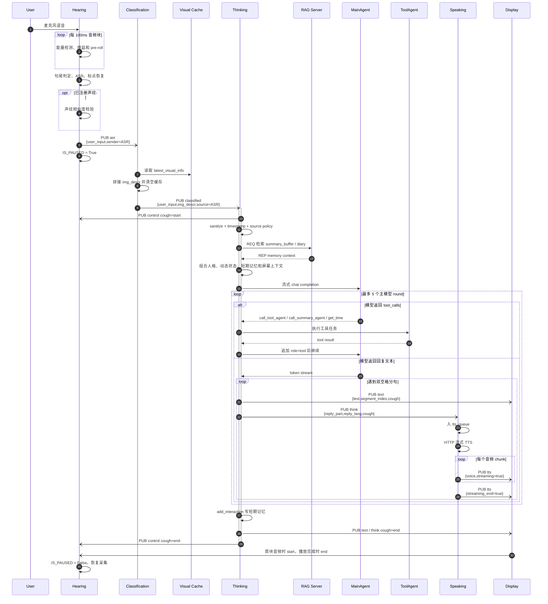
```mermaid
sequenceDiagram
    autonumber
    participant U as User
    participant H as Hearing
    participant C as Classification
    participant V as Visual Cache
    participant T as Thinking
    participant R as RAG Server
    participant L as MainAgent
    participant W as ToolAgent
    participant S as Speaking
    participant D as Display

    U->>H: 麦克风语音
    loop 每 100ms 音频块
        H->>H: 能量检测、增益和 pre-roll
    end
    H->>H: 句尾判定、ASR、标点恢复
    opt 已注册声纹
        H->>H: 声纹相似度校验
    end
    H-)C: PUB asr<br/>{user_input,sender=ASR}
    H->>H: IS_PAUSED = True
    C->>V: 读取 latest_visual_info
    C->>C: 拼接 img_descr 并清空缓存
    C-)T: PUB classified<br/>{user_input,img_descr,source=ASR}

    activate T
    T-)H: PUB control cough=start
    T->>T: sanitize + timestamp + source policy
    T->>R: REQ 检索 summary_buffer / diary
    R-->>T: REP memory context
    T->>T: 组合人格、动态状态、短期记忆和屏幕上下文
    T->>L: 流式 chat completion

    loop 最多 5 个主模型 round
        alt 模型返回 tool_calls
            L-->>T: call_tool_agent / call_summary_agent / get_time
            T->>W: 执行工具任务
            W-->>T: tool result
            T->>L: 追加 role=tool 后继续
        else 模型返回回复文本
            L-->>T: token stream
            loop 遇到双空格分句
                T-)D: PUB text<br/>{text,segment_index,cough}
                T-)S: PUB think<br/>{reply_part,reply_lang,cough}
                S->>S: 入 tts_queue
                S->>S: HTTP 流式 TTS
                loop 每个音频 chunk
                    S-)D: PUB tts<br/>{voice,streaming=true}
                end
                S-)D: PUB tts<br/>{streaming_end=true}
            end
        end
    end

    T->>T: add_interaction 写短期记忆
    T-)D: PUB text / think cough=end
    T-)H: PUB control cough=end
    deactivate T
    D-)H: 首块音频时 start，播放完成时 end
    H->>H: IS_PAUSED = False，恢复采集
```

### 5.1 Hearing

Hearing 持续读取麦克风，执行以下处理：

1. 动态能量阈值与预录缓冲。
2. FunASR Paraformer 识别和标点恢复。
3. 可选声纹验证。
4. 句子结束后发布 `asr`。
5. 自己进入暂停状态，等待 Thinking 或 Display 的 `cough=end`。

Hearing 同时订阅两个控制端口：

- Display 的 `CONTROL_PUB` 表示真实音频播放状态。
- Thinking 的 `CONTROL_PUB_THINKING` 覆盖从思考开始到回复结束的整个阶段。

这样可以避免系统把自己的 TTS 声音再次识别为用户输入。

Hearing 的录音状态由 Thinking 和 Display 两个控制源共同影响：

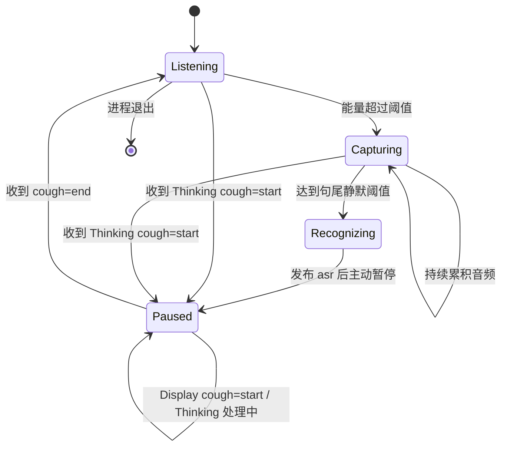
```mermaid
stateDiagram-v2
    [*] --> Listening
    Listening --> Capturing: 能量超过阈值
    Capturing --> Capturing: 持续累积音频
    Capturing --> Recognizing: 达到句尾静默阈值
    Recognizing --> Paused: 发布 asr 后主动暂停
    Listening --> Paused: 收到 Thinking cough=start
    Capturing --> Paused: 收到 Thinking cough=start
    Paused --> Paused: Display cough=start / Thinking 处理中
    Paused --> Listening: 收到 cough=end
    Listening --> [*]: 进程退出
```

### 5.2 Classification

Classification 对 ASR 和 Manual 输入执行相同操作：

1. 读取 `user_input`。
2. 拼接 `latest_visual_info` 中的人脸、物体、手势和场景描述。
3. 非 QQ 请求消费并清空视觉缓存。
4. 发布 `classified` 给 Thinking。

Classification 名称保留了“分类器”，但当前代码并不调用分类模型；它实际是
输入聚合器和协议适配器。

Classification 内部有两个并行执行面：主线程轮询文字输入，后台线程持续更新
视觉缓存。

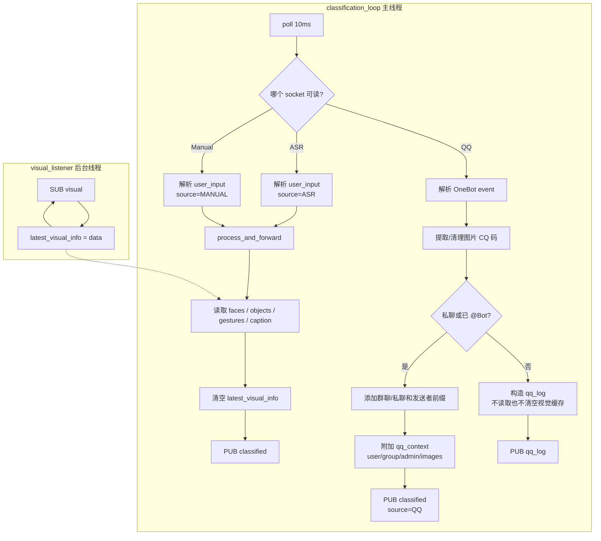
```mermaid
flowchart TB
    subgraph VIS_THREAD["visual_listener 后台线程"]
        VIS_MSG["SUB visual"] --> UPDATE_CACHE["latest_visual_info = data"]
        UPDATE_CACHE --> VIS_MSG
    end

    subgraph MAIN_THREAD["classification_loop 主线程"]
        POLL["poll 10ms"] --> TYPE{"哪个 socket 可读?"}

        TYPE -->|ASR| ASR["解析 user_input<br/>source=ASR"]
        TYPE -->|Manual| MAN["解析 user_input<br/>source=MANUAL"]
        TYPE -->|QQ| QQ["解析 OneBot event"]

        ASR --> FORWARD["process_and_forward"]
        MAN --> FORWARD
        FORWARD --> READ_CACHE["读取 faces / objects / gestures / caption"]
        READ_CACHE --> CLEAR["清空 latest_visual_info"]
        CLEAR --> CLASSIFIED["PUB classified"]

        QQ --> IMAGE["提取/清理图片 CQ 码"]
        IMAGE --> MENTION{"私聊或已 @Bot?"}
        MENTION -->|是| PREFIX["添加群聊/私聊和发送者前缀"]
        PREFIX --> QQCTX["附加 qq_context<br/>user/group/admin/images"]
        QQCTX --> CLASSIFIED_QQ["PUB classified<br/>source=QQ"]
        MENTION -->|否| LOG["构造 qq_log<br/>不读取也不清空视觉缓存"]
        LOG --> QQLOG["PUB qq_log"]
    end

    UPDATE_CACHE -.-> READ_CACHE
```

### 5.3 Thinking

`process_message()` 是旧版单轮请求的中心：

1. 设置全局“正在处理”状态。
2. 清洗伪造的系统事件标记。
3. 向 Hearing 发送 `cough=start`。
4. 载入永久人格、动态状态、短期记忆、RAG 和 QQ 历史。
5. 注入管理员、QQ 工具限制、实时屏幕和视觉上下文。
6. 运行 MainAgent 的流式对话与工具调用循环。
7. 按双空格切分回复，逐段发送 Display 文本和 Speaking TTS 请求。
8. 本地请求写入短期记忆；QQ 请求走独立 QQ Buffer。
9. 发送结束信号并恢复 Hearing。

## 6. Thinking 内部代理与工具链

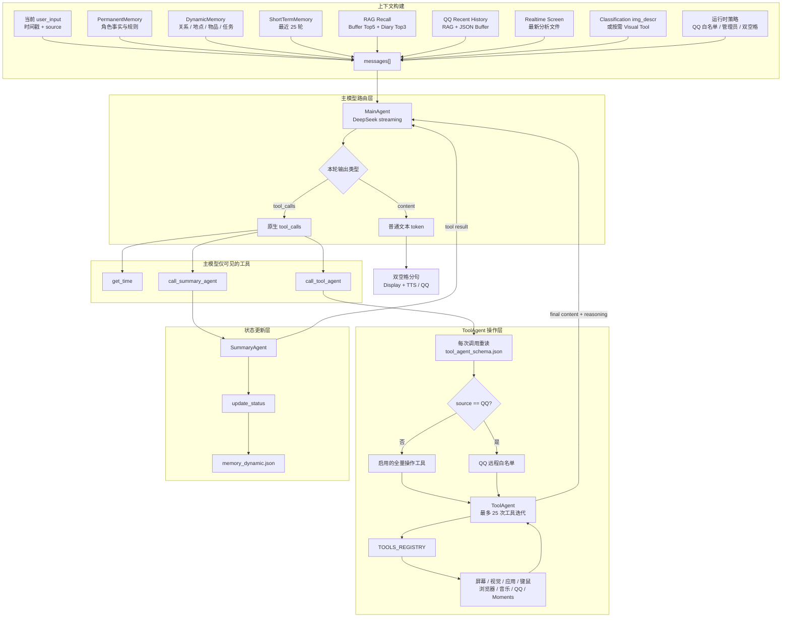
```mermaid
flowchart TB
    subgraph CONTEXT["上下文构建"]
        USER["当前 user_input<br/>时间戳 + source"]
        PERM["PermanentMemory<br/>角色事实与规则"]
        DYN["DynamicMemory<br/>关系 / 地点 / 物品 / 任务"]
        STM["ShortTermMemory<br/>最近 25 轮"]
        RAGCTX["RAG Recall<br/>Buffer Top5 + Diary Top3"]
        QQCTX["QQ Recent History<br/>RAG + JSON Buffer"]
        RT["Realtime Screen<br/>最新分析文件"]
        VIS["Classification img_descr<br/>或按需 Visual Tool"]
        POLICY["运行时策略<br/>QQ 白名单 / 管理员 / 双空格"]
        PROMPT["messages[]"]

        USER --> PROMPT
        PERM --> PROMPT
        DYN --> PROMPT
        STM --> PROMPT
        RAGCTX --> PROMPT
        QQCTX --> PROMPT
        RT --> PROMPT
        VIS --> PROMPT
        POLICY --> PROMPT
    end

    subgraph ROUTER["主模型路由层"]
        MAIN["MainAgent<br/>DeepSeek streaming"]
        DECISION{"本轮输出类型"}
        TEXT["普通文本 token"]
        ROUTER_CALL["原生 tool_calls"]
        PROMPT --> MAIN --> DECISION
        DECISION -->|content| TEXT
        DECISION -->|tool_calls| ROUTER_CALL
    end

    subgraph ROUTER_TOOLS["主模型仅可见的工具"]
        TIME["get_time"]
        CALL_TOOL["call_tool_agent"]
        CALL_SUMMARY["call_summary_agent"]
        ROUTER_CALL --> TIME
        ROUTER_CALL --> CALL_TOOL
        ROUTER_CALL --> CALL_SUMMARY
    end

    subgraph TOOL_LAYER["ToolAgent 操作层"]
        RELOAD["每次调用重读<br/>tool_agent_schema.json"]
        SOURCE{"source == QQ?"}
        FULL["启用的全量操作工具"]
        QQALLOW["QQ 远程白名单"]
        TOOLMODEL["ToolAgent<br/>最多 25 次工具迭代"]
        REGISTRY["TOOLS_REGISTRY"]
        REAL["屏幕 / 视觉 / 应用 / 键鼠<br/>浏览器 / 音乐 / QQ / Moments"]

        CALL_TOOL --> RELOAD --> SOURCE
        SOURCE -->|否| FULL --> TOOLMODEL
        SOURCE -->|是| QQALLOW --> TOOLMODEL
        TOOLMODEL --> REGISTRY --> REAL
        REAL --> TOOLMODEL
        TOOLMODEL -->|"final content + reasoning"| MAIN
    end

    subgraph SUMMARY_LAYER["状态更新层"]
        SUMMARY["SummaryAgent"]
        UPDATE["update_status"]
        DYNAMIC_FILE["memory_dynamic.json"]
        CALL_SUMMARY --> SUMMARY --> UPDATE --> DYNAMIC_FILE
        SUMMARY -->|"tool result"| MAIN
    end

    TEXT --> STREAM["双空格分句<br/>Display + TTS / QQ"]
```

MainAgent 只挂载路由工具：

- `get_time`
- `call_tool_agent`
- `call_summary_agent`

ToolAgent 根据 `server/tool_agent_schema.json` 的 `enabled` 字段动态挂载实际
工具。每次调用前都会重新读取配置，因此管理页修改无需重启 Thinking。

QQ 来源会额外过滤工具，只保留 QQ、搜索、动态、时间和唱歌等白名单工具，
禁止远程用户操作本机屏幕、键鼠和应用。

工具运行时依赖通过 `tools.dependencies.deps` 注入，避免工具直接导入
`handle_zmq.py` 的全局对象。典型依赖包括：

- ZeroMQ Context
- ThinkingModelHelper
- LayeredMemorySystem
- 本地音频 PUB socket
- 工具 schema 与 registry 访问器

MainAgent 的多轮收敛方式如下：

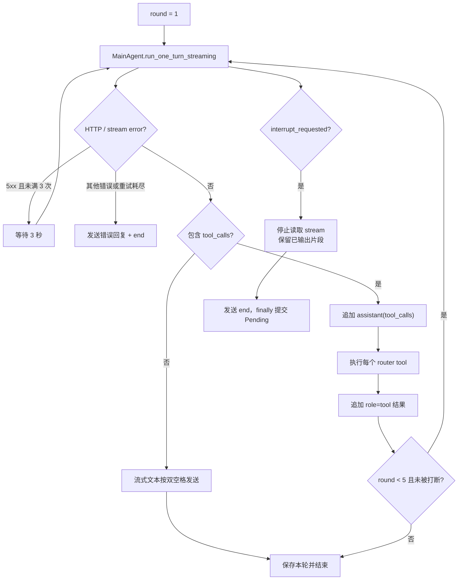
```mermaid
flowchart TD
    BEGIN["round = 1"] --> REQUEST["MainAgent.run_one_turn_streaming"]
    REQUEST --> ERROR{"HTTP / stream error?"}
    ERROR -->|5xx 且未满 3 次| RETRY["等待 3 秒"] --> REQUEST
    ERROR -->|其他错误或重试耗尽| ERROR_REPLY["发送错误回复 + end"]
    ERROR -->|否| RESULT{"包含 tool_calls?"}

    RESULT -->|否| SEGMENT["流式文本按双空格发送"]
    SEGMENT --> SAVE["保存本轮并结束"]

    RESULT -->|是| APPEND["追加 assistant(tool_calls)"]
    APPEND --> EXECUTE["执行每个 router tool"]
    EXECUTE --> TOOL_MSG["追加 role=tool 结果"]
    TOOL_MSG --> NEXT{"round < 5 且未被打断?"}
    NEXT -->|是| REQUEST
    NEXT -->|否| SAVE

    REQUEST --> INTERRUPT{"interrupt_requested?"}
    INTERRUPT -->|是| PARTIAL["停止读取 stream<br/>保留已输出片段"]
    PARTIAL --> END_SIGNAL["发送 end，finally 提交 Pending"]
```

## 7. 文本、TTS 和 Display 输出链

Thinking 的 `zmq_send()` 同时承担两个输出：

1. 有文本时，向 `THINKING_TEXT_PUB` 发布 `text`，Display 可以立即显示。
2. 开启音频时，向 `THINKING_TTS_PUB` 发布 `think`，Speaking 开始合成。

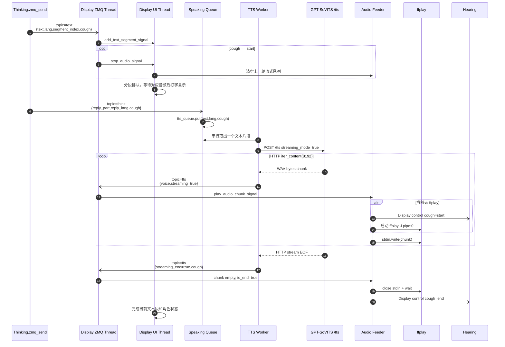
```mermaid
sequenceDiagram
    autonumber
    participant T as Thinking.zmq_send
    participant DQ as Display ZMQ Thread
    participant UI as Display UI Thread
    participant SQ as Speaking Queue
    participant TW as TTS Worker
    participant API as GPT-SoVITS /tts
    participant AF as Audio Feeder
    participant FF as ffplay
    participant H as Hearing

    T-)DQ: topic=text<br/>{text,lang,segment_index,cough}
    DQ->>UI: add_text_segment_signal
    opt cough == start
        DQ->>UI: stop_audio_signal
        UI->>AF: 清空上一轮流式队列
    end
    UI->>UI: 分段排队，等待对应音频后打字显示

    T-)SQ: topic=think<br/>{reply_part,reply_lang,cough}
    SQ->>SQ: tts_queue.put(text,lang,cough)
    TW->>SQ: 串行取出一个文本片段
    TW->>API: POST /tts streaming_mode=true

    loop HTTP iter_content(8192)
        API-->>TW: WAV bytes chunk
        TW-)DQ: topic=tts<br/>{voice,streaming=true}
        DQ->>AF: play_audio_chunk_signal
        alt 当前无 ffplay
            AF-)H: Display control cough=start
            AF->>FF: 启动 ffplay -i pipe:0
        end
        AF->>FF: stdin.write(chunk)
    end

    API-->>TW: HTTP stream EOF
    TW-)DQ: topic=tts<br/>{streaming_end=true,cough}
    DQ->>AF: chunk empty, is_end=true
    AF->>FF: close stdin + wait
    AF-)H: Display control cough=end
    UI->>UI: 完成当前文本段和角色状态
```

Speaking 使用单个后台 worker 串行消费文本片段：

1. 调用 GPT-SoVITS `/tts` 流式接口。
2. 每收到一个音频块立即 Base64 编码。
3. 发布 `tts` 且标记 `streaming=true`。
4. 当前文本片段结束后发布 `streaming_end=true`。

Display 分开处理文本与音频：

- `text` 驱动分段文本和打字机效果。
- `tts` 音频块写入 ffplay stdin。
- 第一块音频到达时发布 `cough=start`。
- 播放完成后发布 `cough=end`。
- 新回复带 `cough=start` 时会停止上一轮音频并清空播放队列。

文本不依赖 TTS，因此 Speaking 故障时 Display 仍可显示回复。

每个 topic 的核心载荷如下：

| Topic | 关键字段 | 字段作用 |
| --- | --- | --- |
| `text` | `text`、`lang`、`segment_index`、`cough`、`translation`、`origin` | 文本展示、分段顺序和新回复边界 |
| `think` | `reply_part`、`reply_lang`、`cough`、`origin` | TTS 输入及翻译旁路 |
| `tts` | `voice`、`streaming`、`streaming_end`、`cough` | Base64 音频块、流结束与播放边界 |
| `control` | `cough=start/end` | Hearing 暂停/恢复及 Thinking 播放忙碌状态 |

## 8. QQ 消息链路

### 8.1 接收与分流

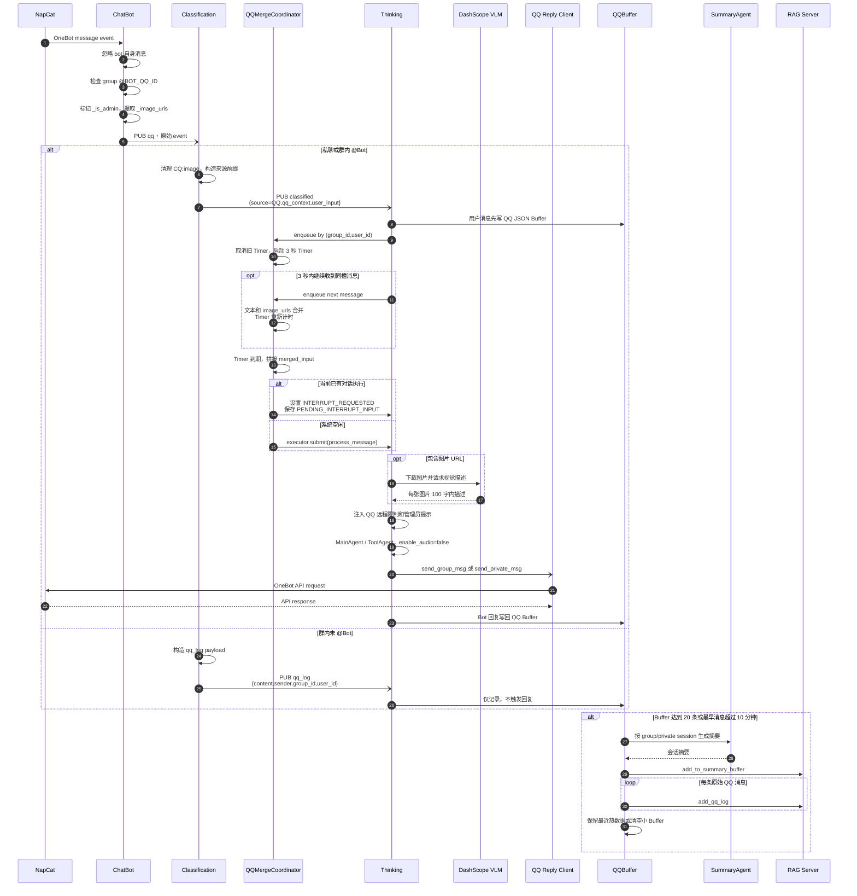
```mermaid
sequenceDiagram
    autonumber
    participant N as NapCat
    participant Q as ChatBot
    participant C as Classification
    participant M as QQMergeCoordinator
    participant T as Thinking
    participant V as DashScope VLM
    participant O as QQ Reply Client
    participant B as QQBuffer
    participant S as SummaryAgent
    participant R as RAG Server

    N->>Q: OneBot message event
    Q->>Q: 忽略 bot 自身消息
    Q->>Q: 检查 group @BOT_QQ_ID
    Q->>Q: 标记 _is_admin，提取 _image_urls
    Q-)C: PUB qq + 原始 event

    alt 私聊或群内 @Bot
        C->>C: 清理 CQ:image，构造来源前缀
        C-)T: PUB classified<br/>{source=QQ,qq_context,user_input}
        T->>B: 用户消息先写 QQ JSON Buffer
        T->>M: enqueue by (group_id,user_id)
        M->>M: 取消旧 Timer，启动 3 秒 Timer
        opt 3 秒内继续收到同槽消息
            T->>M: enqueue next message
            M->>M: 文本和 image_urls 合并<br/>Timer 重新计时
        end
        M->>M: Timer 到期，拼接 merged_input
        alt 当前已有对话执行
            M->>T: 设置 INTERRUPT_REQUESTED<br/>保存 PENDING_INTERRUPT_INPUT
        else 系统空闲
            M->>T: executor.submit(process_message)
        end

        opt 包含图片 URL
            T->>V: 下载图片并请求视觉描述
            V-->>T: 每张图片 100 字内描述
        end
        T->>T: 注入 QQ 远程限制和管理员提示
        T->>T: MainAgent / ToolAgent，enable_audio=false
        T-)O: send_group_msg 或 send_private_msg
        O->>N: OneBot API request
        N-->>O: API response
        T->>B: Bot 回复写回 QQ Buffer
    else 群内未 @Bot
        C->>C: 构造 qq_log payload
        C-)T: PUB qq_log<br/>{content,sender,group_id,user_id}
        T->>B: 仅记录，不触发回复
    end

    alt Buffer 达到 20 条或最早消息超过 10 分钟
        B->>S: 按 group/private session 生成摘要
        S-->>B: 会话摘要
        B->>R: add_to_summary_buffer
        loop 每条原始 QQ 消息
            B->>R: add_qq_log
        end
        B->>B: 保留最近热数据或清空小 Buffer
    end
```

ChatBot 只负责 OneBot 协议适配：

- 忽略机器人自己发送的事件。
- 私聊默认触发。
- 群聊只有明确 `@Bot` 才触发回复。
- 标记管理员身份。
- 提取图片 URL。

Classification 将触发消息包装成 `[QQ群消息]` 或 `[QQ私聊]` 文本。
未触发的群消息发布为 `qq_log`，用于建立背景记忆。

### 8.2 合并、打断与串行化

Thinking 使用 `(group_id, user_id)` 作为 QQ 合并槽：

- 同一槽 3 秒内的连续消息合并为一条。
- 不同群或用户不会互相合并。
- 新消息到达时会取消旧定时器并重新计时。
- 如果 Thinking 正在处理，合并后的消息进入 Pending。
- 当前轮在流式输出或工具执行的检查点感知打断，收尾后提交 Pending。

虽然 Thinking 创建了两个 worker，`processing_state` 和
`IS_PROCESSING_DIALOGUE` 使主要对话仍近似全局串行。

合并与打断的状态变化如下：

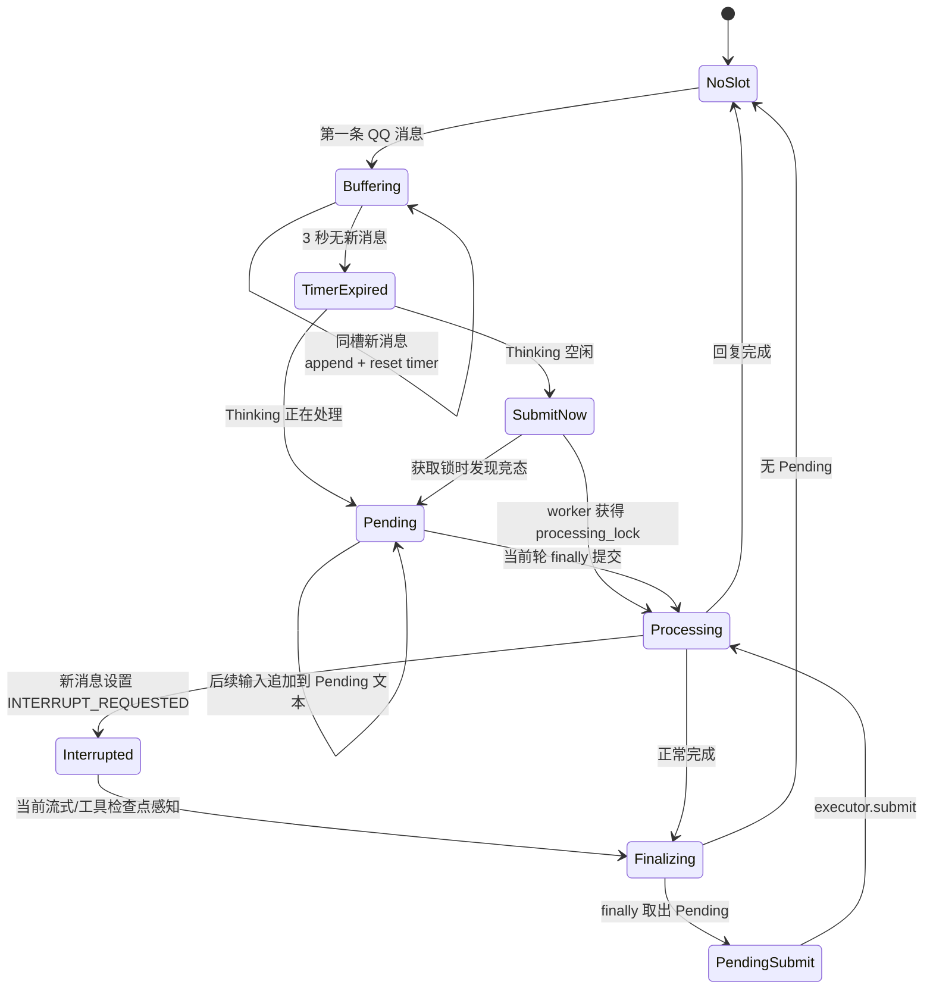
```mermaid
stateDiagram-v2
    [*] --> NoSlot
    NoSlot --> Buffering: 第一条 QQ 消息
    Buffering --> Buffering: 同槽新消息<br/>append + reset timer
    Buffering --> TimerExpired: 3 秒无新消息
    TimerExpired --> SubmitNow: Thinking 空闲
    TimerExpired --> Pending: Thinking 正在处理
    SubmitNow --> Processing: worker 获得 processing_lock
    SubmitNow --> Pending: 获取锁时发现竞态
    Processing --> Interrupted: 新消息设置 INTERRUPT_REQUESTED
    Interrupted --> Finalizing: 当前流式/工具检查点感知
    Processing --> Finalizing: 正常完成
    Finalizing --> PendingSubmit: finally 取出 Pending
    PendingSubmit --> Processing: executor.submit
    Finalizing --> NoSlot: 无 Pending
    Pending --> Pending: 后续输入追加到 Pending 文本
    Pending --> Processing: 当前轮 finally 提交
    Processing --> NoSlot: 回复完成
```

### 8.3 QQ 回复

QQ 请求设置 `enable_audio=false`，因此不触发 TTS，但回复文本仍会发布到本地
Display。随后 `qq_reply_flow` 调用 `tools.qq_tool`：

- 群聊首段 `@` 原发送者，后续分段不重复 `@`。
- 私聊直接发送。
- 回复优先按双空格切段，长文本回退到中文句末切段。
- 每段间隔约 0.8 秒。
- Bot 回复也写回 QQ Buffer，保证后续上下文完整。

QQ 请求与本地请求的输出差异：

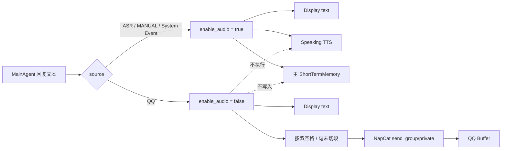
```mermaid
flowchart LR
    RESPONSE["MainAgent 回复文本"] --> SOURCE{"source"}
    SOURCE -->|"ASR / MANUAL / System Event"| LOCAL["enable_audio = true"]
    SOURCE -->|"QQ"| REMOTE["enable_audio = false"]

    LOCAL --> DISPLAY1["Display text"]
    LOCAL --> TTS["Speaking TTS"]
    LOCAL --> STM["主 ShortTermMemory"]

    REMOTE --> DISPLAY2["Display text"]
    REMOTE --> SPLIT["按双空格 / 句末切段"]
    SPLIT --> QQAPI["NapCat send_group/private"]
    QQAPI --> QQBUF["QQ Buffer"]
    REMOTE -.->|"不执行"| TTS
    REMOTE -.->|"不写入"| STM
```

## 9. 视觉链路

Visual 维护摄像头最新帧，但重型识别主要按请求执行：

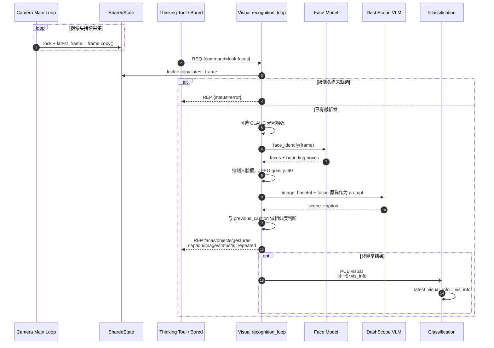
```mermaid
sequenceDiagram
    autonumber
    participant CAM as Camera Main Loop
    participant STATE as SharedState
    participant CLIENT as Thinking Tool / Bored
    participant REP as Visual recognition_loop
    participant FACE as Face Model
    participant VLM as DashScope VLM
    participant C as Classification

    loop 摄像头持续采集
        CAM->>STATE: lock + latest_frame = frame.copy()
    end

    CLIENT->>REP: REQ {command=look,focus}
    REP->>STATE: lock + copy latest_frame
    alt 摄像头尚未就绪
        REP-->>CLIENT: REP {status=error}
    else 已有最新帧
        REP->>REP: 可选 CLAHE 光照增强
        REP->>FACE: face_identify(frame)
        FACE-->>REP: faces + bounding boxes
        REP->>REP: 绘制人脸框，JPEG quality=40
        REP->>VLM: image_base64 + focus 原样作为 prompt
        VLM-->>REP: scene_caption
        REP->>REP: 与 previous_caption 做相似度判断
        REP-->>CLIENT: REP faces/objects/gestures<br/>caption/image/status/is_repeated
        opt 非重复结果
            REP-)C: PUB visual<br/>同一份 vis_info
            C->>C: latest_visual_info = vis_info
        end
    end
```

Visual 返回：

- `faces`
- `objects`
- `gestures`
- `scene_caption`
- `scene_image`
- `is_repeated`

Classification 只缓存 `VISUAL_PUB` 最近一次结果。真正要求“现在看一下”时，
Thinking 的视觉工具应走 `VISUAL_REQREP`，避免依赖旧缓存。

系统存在两种视觉上下文，语义和时效不同：

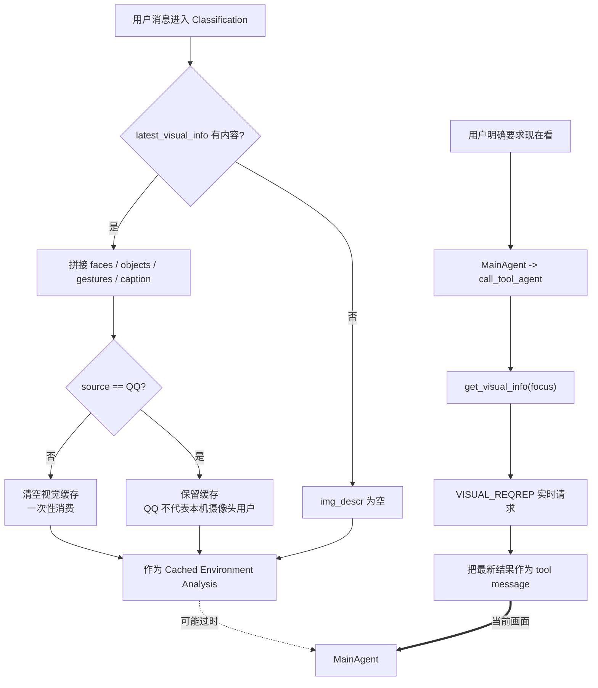
```mermaid
flowchart TB
    REQUEST["用户消息进入 Classification"] --> CACHE{"latest_visual_info 有内容?"}
    CACHE -->|是| MERGE["拼接 faces / objects / gestures / caption"]
    CACHE -->|否| EMPTY["img_descr 为空"]
    MERGE --> SOURCE{"source == QQ?"}
    SOURCE -->|否| CONSUME["清空视觉缓存<br/>一次性消费"]
    SOURCE -->|是| KEEP["保留缓存<br/>QQ 不代表本机摄像头用户"]
    CONSUME --> PROMPT1["作为 Cached Environment Analysis"]
    KEEP --> PROMPT1
    EMPTY --> PROMPT1

    CURRENT["用户明确要求现在看"] --> TOOL["MainAgent -> call_tool_agent"]
    TOOL --> LOOK["get_visual_info(focus)"]
    LOOK --> REQ["VISUAL_REQREP 实时请求"]
    REQ --> PROMPT2["把最新结果作为 tool message"]

    PROMPT1 -.->|"可能过时"| MODEL["MainAgent"]
    PROMPT2 ==>|"当前画面"| MODEL
```

## 10. 记忆与 RAG 链路

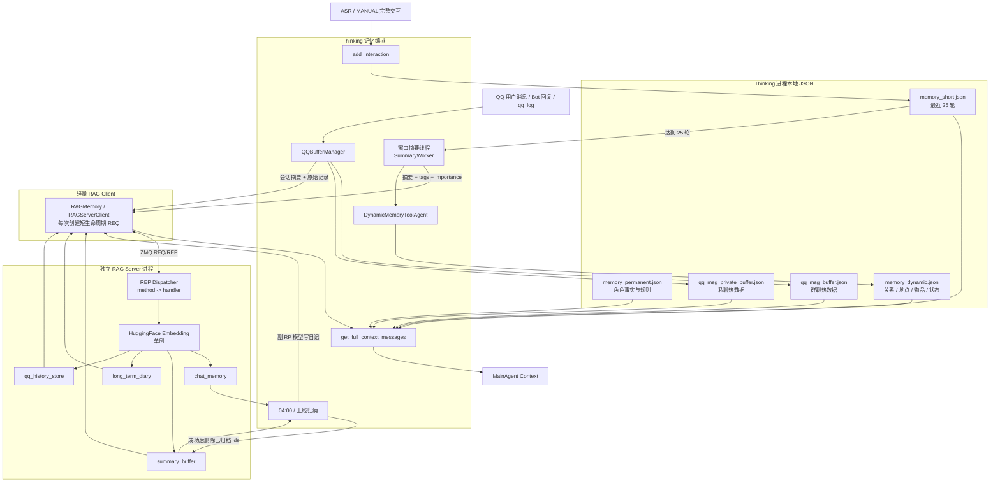
```mermaid
flowchart TB
    subgraph LOCAL_FILES["Thinking 进程本地 JSON"]
        PERMANENT["memory_permanent.json<br/>角色事实与规则"]
        DYNAMIC["memory_dynamic.json<br/>关系 / 地点 / 物品 / 状态"]
        SHORT["memory_short.json<br/>最近 25 轮"]
        GROUP_BUF["qq_msg_buffer.json<br/>群聊热数据"]
        PRIVATE_BUF["qq_msg_private_buffer.json<br/>私聊热数据"]
    end

    subgraph THINKING_MEM["Thinking 记忆编排"]
        BUILD["get_full_context_messages"]
        ADD["add_interaction"]
        EPISODE["窗口摘要线程<br/>SummaryWorker"]
        QQMGR["QQBufferManager"]
        DIARY_JOB["04:00 / 上线归纳"]
        DYNAMIC_AGENT["DynamicMemoryToolAgent"]
    end

    subgraph RPC_LAYER["轻量 RAG Client"]
        CLIENT["RAGMemory / RAGServerClient<br/>每次创建短生命周期 REQ"]
    end

    subgraph RAG_PROCESS["独立 RAG Server 进程"]
        RPC["REP Dispatcher<br/>method -> handler"]
        EMB["HuggingFace Embedding<br/>单例"]
        CHAT["chat_memory"]
        SUMMARY_BUF["summary_buffer"]
        DIARY["long_term_diary"]
        QQHISTORY["qq_history_store"]
    end

    PERMANENT --> BUILD
    DYNAMIC --> BUILD
    SHORT --> BUILD
    GROUP_BUF --> BUILD
    PRIVATE_BUF --> BUILD
    CLIENT --> BUILD
    BUILD --> PROMPT["MainAgent Context"]

    LOCAL_REPLY["ASR / MANUAL 完整交互"] --> ADD --> SHORT
    SHORT -->|"达到 25 轮"| EPISODE
    EPISODE -->|"摘要 + tags + importance"| CLIENT
    EPISODE --> DYNAMIC_AGENT --> DYNAMIC

    QQ_INPUT["QQ 用户消息 / Bot 回复 / qq_log"] --> QQMGR
    QQMGR --> GROUP_BUF
    QQMGR --> PRIVATE_BUF
    QQMGR -->|"会话摘要 + 原始记录"| CLIENT

    CLIENT <-->|"ZMQ REQ/REP"| RPC
    RPC --> EMB
    EMB --> CHAT
    EMB --> SUMMARY_BUF
    EMB --> DIARY
    EMB --> QQHISTORY

    SUMMARY_BUF --> DIARY_JOB
    CHAT --> DIARY_JOB
    DIARY_JOB -->|"副 RP 模型写日记"| CLIENT
    DIARY_JOB -->|"成功后删除已归档 ids"| SUMMARY_BUF

    SUMMARY_BUF --> CLIENT
    DIARY --> CLIENT
    QQHISTORY --> CLIENT
```

Thinking 进程使用轻量 `RAGMemory` 客户端，每次请求通过短生命周期 REQ socket
调用独立 RAG Server。Embedding、PyTorch、LangChain 和 ChromaDB 只在 RAG
进程加载，避免占用 Thinking 进程。

本地对话与 QQ 对话采用不同写入策略：

- 本地 ASR/Manual 对话写入主短期记忆。
- QQ 对话不写主短期记忆，写群聊或私聊 JSON Buffer。
- QQ Buffer 满 20 条或最早消息超过 10 分钟后，按会话摘要并写入 RAG。
- 未被 @ 的群消息同样进入 QQ Buffer，因此模型可在以后读取群聊背景。
- Bot 的回复也进入 QQ Buffer。

每天以 04:00 为日期边界。Buffer 中非当天内容会被归纳为日记；RAG GC 在
凌晨窗口尝试清理低访问、较旧的内容。

单次请求的记忆读取顺序：

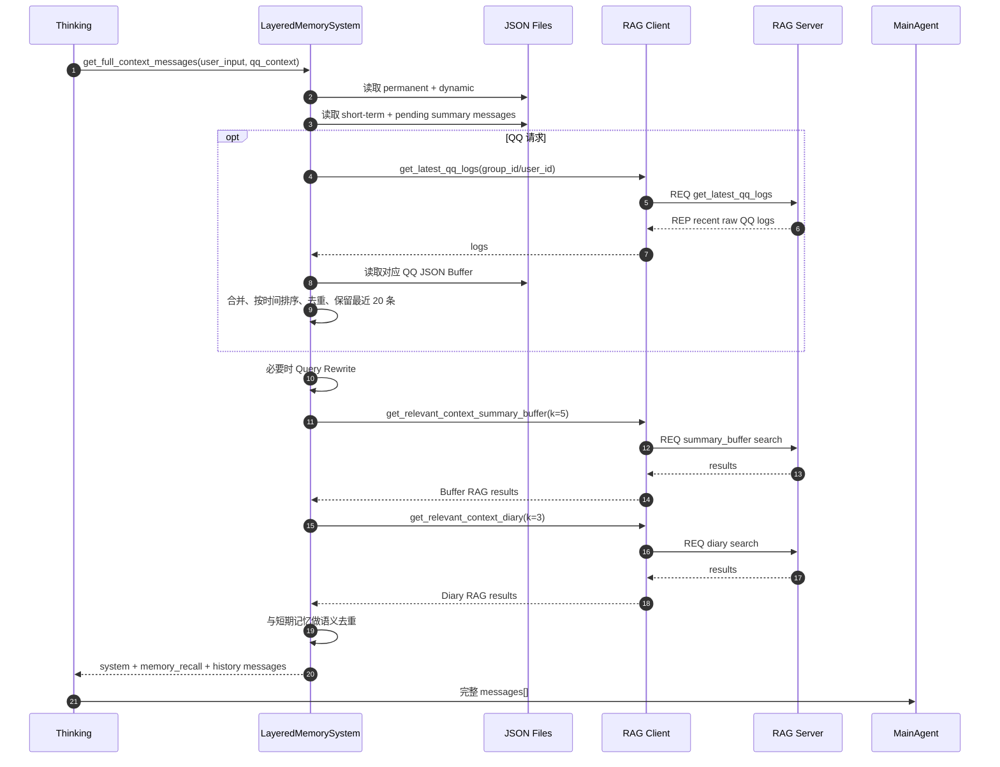
```mermaid
sequenceDiagram
    autonumber
    participant T as Thinking
    participant L as LayeredMemorySystem
    participant J as JSON Files
    participant C as RAG Client
    participant R as RAG Server
    participant M as MainAgent

    T->>L: get_full_context_messages(user_input, qq_context)
    L->>J: 读取 permanent + dynamic
    L->>J: 读取 short-term + pending summary messages
    opt QQ 请求
        L->>C: get_latest_qq_logs(group_id/user_id)
        C->>R: REQ get_latest_qq_logs
        R-->>C: REP recent raw QQ logs
        C-->>L: logs
        L->>J: 读取对应 QQ JSON Buffer
        L->>L: 合并、按时间排序、去重、保留最近 20 条
    end
    L->>L: 必要时 Query Rewrite
    L->>C: get_relevant_context_summary_buffer(k=5)
    C->>R: REQ summary_buffer search
    R-->>C: results
    C-->>L: Buffer RAG results
    L->>C: get_relevant_context_diary(k=3)
    C->>R: REQ diary search
    R-->>C: results
    C-->>L: Diary RAG results
    L->>L: 与短期记忆做语义去重
    L-->>T: system + memory_recall + history messages
    T->>M: 完整 messages[]
```

本地短期记忆从活跃窗口进入日记的生命周期：

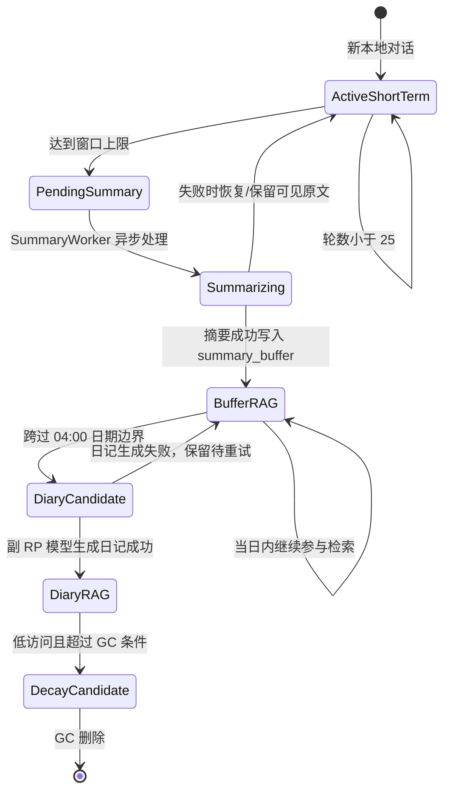
```mermaid
stateDiagram-v2
    [*] --> ActiveShortTerm: 新本地对话
    ActiveShortTerm --> ActiveShortTerm: 轮数小于 25
    ActiveShortTerm --> PendingSummary: 达到窗口上限
    PendingSummary --> Summarizing: SummaryWorker 异步处理
    Summarizing --> BufferRAG: 摘要成功写入 summary_buffer
    Summarizing --> ActiveShortTerm: 失败时恢复/保留可见原文
    BufferRAG --> BufferRAG: 当日内继续参与检索
    BufferRAG --> DiaryCandidate: 跨过 04:00 日期边界
    DiaryCandidate --> DiaryRAG: 副 RP 模型生成日记成功
    DiaryCandidate --> BufferRAG: 日记生成失败，保留待重试
    DiaryRAG --> DecayCandidate: 低访问且超过 GC 条件
    DecayCandidate --> [*]: GC 删除
```

## 11. 主动对话链路

### 11.1 Bored Detector

Bored Detector 每 10 秒检查一次共享记忆文件：

1. 用户新消息会把无聊值清零。
2. 关系越亲近，增长越快。
3. 02:00-08:00 增速显著降低。
4. “晚安、去忙、别吵”等结束语会进入静默期。
5. 无聊值达到 100 后，再由轻量 LLM 判断是否打扰。
6. 低概率通过 `VISUAL_REQREP` 检查视觉变化，新内容可立即触发。

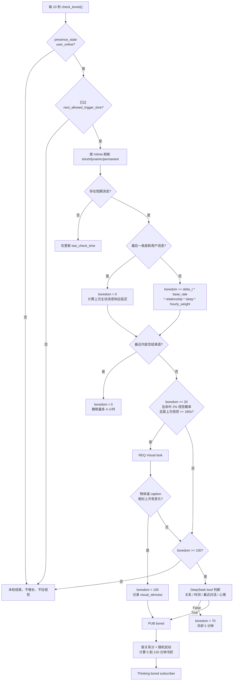
```mermaid
flowchart TD
    TICK["每 10 秒 check_bored()"] --> ONLINE{"presence_state<br/>user_online?"}
    ONLINE -->|否| STOP["本轮结束，不增长、不拉视觉"]
    ONLINE -->|是| COOLDOWN{"已过 next_allowed_trigger_time?"}
    COOLDOWN -->|否| STOP
    COOLDOWN -->|是| RELOAD["按 mtime 刷新 short/dynamic/permanent"]
    RELOAD --> HASMSG{"存在短期消息?"}
    HASMSG -->|否| RESET_CLOCK["仅更新 last_check_time"]
    HASMSG -->|是| NEWUSER{"最后一条是新用户消息?"}

    NEWUSER -->|是| RESET["boredom = 0<br/>计算上次主动消息响应延迟"]
    NEWUSER -->|否| GROW["boredom += delta_t * base_rate<br/>* relationship * sleep * hourly_weight"]
    RESET --> BLOCK{"最近内容含结束语?"}
    GROW --> BLOCK
    BLOCK -->|是| SILENT["boredom = 0<br/>静默最多 4 小时"]
    BLOCK -->|否| VISUAL_CHANCE{"boredom >= 20<br/>且命中 2% 视觉概率<br/>且距上次视觉 >= 180s?"}

    VISUAL_CHANCE -->|是| LOOK["REQ Visual look"]
    LOOK --> CHANGED{"物体或 caption<br/>相对上次有变化?"}
    CHANGED -->|是| VIS_TRIGGER["boredom = 100<br/>记录 visual_stimulus"]
    CHANGED -->|否| FULL{"boredom >= 100?"}
    VISUAL_CHANCE -->|否| FULL
    VIS_TRIGGER --> PUBLISH["PUB bored"]

    FULL -->|否| STOP
    FULL -->|是| JUDGE["DeepSeek bool 判断<br/>关系 / 时间 / 最近对话 / 心情"]
    JUDGE -->|"False"| BACKOFF["boredom = 70<br/>冷却 5 分钟"]
    JUDGE -->|"True"| PUBLISH
    PUBLISH --> CD["按关系分 + 随机扰动<br/>计算 5 到 120 分钟冷却"]
    CD --> THINK["Thinking bored subscriber"]
```

触发后发布 `bored`。Thinking 收到后：

1. 检查 `presence_state.json`，用户离线时忽略。
2. 如果正在处理对话则拒绝本次触发。
3. 触碰 `realtime_screen_flush.signal` 请求最新屏幕分析。
4. 构造系统事件 Prompt 并作为普通请求交给 `process_message()`。

```mermaid
sequenceDiagram
    autonumber
    participant B as Bored Detector
    participant T as Thinking Poll Loop
    participant F as Flush Signal File
    participant RS as Realtime Screen
    participant P as process_message
    participant M as MainAgent

    B-)T: PUB bored {timestamp,visual_stimulus?}
    T->>T: 检查本地用户在线状态
    alt 用户离线
        T->>T: 丢弃事件
    else 用户在线但正在处理
        T->>T: 拒绝本次 bored，不进入 Pending
    else 用户在线且空闲
        T->>F: touch realtime_screen_flush.signal
        RS->>F: 轮询 mtime
        RS->>RS: 强制分析并更新 analysis.txt
        T->>T: 等待约 1.5 秒
        T->>T: build_bored_prompt()
        T->>P: executor.submit(system event)
        P->>P: 读取最新 realtime screen 分析
        P->>M: 作为普通对话请求执行
    end
```

### 11.2 Realtime Screen

Realtime Screen 不走 ZMQ，而是文件协议：

| 文件 | 写入方 | 读取方 | 作用 |
| --- | --- | --- | --- |
| `realtime_screen_config.json` | Module Manager | Realtime Screen、Thinking | 开关、间隔和变化阈值 |
| `realtime_screen_context.json` | Thinking | Realtime Screen | 最近用户输入与助手回复 |
| `realtime_screen_analysis.txt` | Realtime Screen | Thinking | 最新屏幕 VLM 分析 |
| `realtime_screen_flush.signal` | Thinking | Realtime Screen | 强制刷新信号 |
| `realtime_screen_pid.txt` | Realtime Screen | Module Manager | 进程状态 |

普通模式下，分析内容只在下一次用户请求中作为系统上下文注入。游戏模式下，
如果屏幕内容变化且 Thinking、播放器均空闲，可以生成 synthetic prompt，
主动触发一次 `process_message()`。

```mermaid
sequenceDiagram
    autonumber
    participant UI as Module Manager
    participant CFG as config.json
    participant RS as Realtime Screen
    participant CTX as context.json
    participant SIG as flush.signal
    participant VLM as DashScope VLM
    participant OUT as analysis.txt
    participant T as Thinking

    UI->>CFG: 保存 enabled / interval / min_change_ratio
    alt enabled=true 且进程未运行
        UI->>RS: subprocess.Popen
        RS->>RS: 写 PID 文件
    else enabled=false
        UI->>RS: SIGTERM
    end

    loop enabled 时按 interval_sec
        RS->>CFG: 读取最新配置
        RS->>CTX: 读取 user_input + assistant_output
        RS->>SIG: 检查强制刷新 mtime
        RS->>RS: mss 截图、缩放、pHash + 中心区变化率
        alt 变化不足且无交互/强制刷新
            RS->>RS: 跳过 VLM，保留已有 buffer
        else 需要分析
            RS->>VLM: 当前帧或三帧拼图 + 对话关注点
            VLM-->>RS: 屏幕描述
            RS->>RS: 追加带时间戳的 analysis_buffer
        end

        alt 用户输入 / 助手输出 / flush / 周期 / buffer 满
            RS->>OUT: 覆盖写入汇总分析
            RS->>RS: 清空 analysis_buffer
        end
    end

    T->>CFG: 每次请求检查 enabled
    T->>OUT: 读取最新分析
    T->>T: 注入 system message
    T->>CTX: 回复结束后写入本轮上下文
```

游戏模式下还有一条“屏幕变化主动评论”链路：

```mermaid
flowchart LR
    POLL["Thinking 空闲分支<br/>每约 3 秒检查"] --> READ["读取 analysis.txt"]
    READ --> CHANGED{"内容相对上次推送有变化?"}
    CHANGED -->|否| WAIT["等待下次"]
    CHANGED -->|是| MODE{"GAME_MODE_ENABLED?"}
    MODE -->|否| MARK["只更新 last_pushed_content"]
    MODE -->|是| BUSY{"正在处理或正在播放?"}
    BUSY -->|是| MARK
    BUSY -->|否| SYNTH["构造 synthetic prompt<br/>请判断是否需要评论"]
    SYNTH --> EXEC["executor.submit(process_message)"]
    EXEC --> MAIN["MainAgent 可选择回复或沉默"]
```

## 12. 管理与控制链路

Module Manager 负责：

- 启动、停止单服务或全部服务。
- 启动前按服务清理其 bind 端口。
- 捕获 stdout/stderr，并通过 SSE 推送日志。
- 修改 ToolAgent 工具启用状态。
- 切换用户在线状态。
- 启停 Realtime Screen。
- 发布游戏模式与在线状态 `syscmd`。

```mermaid
flowchart TB
    BROWSER["浏览器管理页"] --> API["Flask API"]

    subgraph PROCESS["进程生命周期"]
        API --> START{"start one / start all"}
        START --> PORTS["查询 SERVICE_BIND_PORTS"]
        PORTS --> CLEAN["port_cleanup"]
        CLEAN --> POPEN["subprocess.Popen<br/>cwd + interpreter + script"]
        POPEN --> OUT["stdout reader thread"]
        POPEN --> ERR["stderr reader thread"]
        OUT --> QUEUE["per-service log_queue"]
        ERR --> QUEUE
        QUEUE --> POLL["GET logs / SSE stream"]
        POLL --> BROWSER

        API --> STOP["stop service"]
        STOP --> TERM["terminate -> wait 5s"]
        TERM -->|"超时"| KILL["kill"]
    end

    subgraph RUNTIME["运行时控制"]
        API --> GAME["POST game_mode"]
        GAME --> SYSCMD["PUB syscmd<br/>enable/disable_game_mode"]
        SYSCMD --> THINKING["Thinking"]

        API --> PRESENCE["POST presence"]
        PRESENCE --> PFILE["原子写 presence_state.json"]
        PRESENCE --> PUBLISH["PUB syscmd update_presence"]
        PUBLISH --> THINKING

        API --> TOOLCFG["POST tool_agent_tools"]
        TOOLCFG --> TOOLFILE["写 tool_agent_schema.json"]
        TOOLFILE -.->|"下次 ToolAgent 调用时重读"| THINKING

        API --> SCREENCFG["POST realtime_screen_config"]
        SCREENCFG --> SCREENFILE["写配置 + 同步 get_screen_info enabled"]
        SCREENCFG --> SCREENPROC["启动或停止 Realtime Screen"]
    end
```

Thinking 订阅 `syscmd` 后更新：

- `enable_game_mode`
- `disable_game_mode`
- `update_presence`

在线状态同时持久化到 `presence_state.json`。Bored Detector 和 Thinking
主动对话路径都以该文件为最终判断依据。

Thinking 正式上线后还会启动 `status_ws.py` 后台线程，连接 Moments 后端的
`/api/status/bines/ws`：

- WebSocket 连接存在时，由后端维护 Bines 的在线状态。
- 连接断开后每 5 秒重连。
- 使用 `TOGGLE_STATUS_TOKEN` 作为 query 和请求头凭据。
- 此连接与本地 `presence_state.json` 含义不同：前者表示 Bines 服务在线，
  后者表示本地用户是否允许主动打扰。

三个容易混淆的“在线/忙碌”状态分别属于不同层：

```mermaid
flowchart LR
    USER_STATE["presence_state.json<br/>本地用户是否在线"] --> BORED_POLICY["是否允许主动打扰"]
    SERVICE_WS["status_ws.py<br/>到 Moments 的 WebSocket"] --> SERVICE_STATE["Bines 服务是否在线"]
    PLAY_STATE["Display CONTROL_PUB<br/>cough start/end"] --> PLAYER_BUSY["Thinking is_player_busy"]
    DIALOG_STATE["IS_PROCESSING_DIALOGUE<br/>processing_state"] --> PROCESS_BUSY["是否已有对话执行"]

    BORED_POLICY --> ACTIVE{"允许主动请求?"}
    PLAYER_BUSY --> ACTIVE
    PROCESS_BUSY --> ACTIVE
    SERVICE_STATE -.->|"仅外部状态展示"| ACTIVE
```

## 13. 故障影响范围

| 故障模块 | 直接影响 | 可继续工作的部分 |
| --- | --- | --- |
| Classification | 所有 ASR、Manual、QQ 主请求无法进入 Thinking | 管理页、已有主动链可能仍运行 |
| Thinking | 无回复、无工具、无记忆更新 | 输入采集和管理页可运行 |
| RAG Server | 检索和记忆写入超时，启动握手可能阻塞 | LLM 主回复理论上可降级继续 |
| Speaking | 无 TTS 音频 | 文本仍可在 Display 展示，QQ 回复不受影响 |
| Display | 无角色 UI 和本地播放状态 | QQ 回复、Thinking、RAG 可运行 |
| Hearing | 无本地语音输入 | QQ、Manual 输入仍可用 |
| Visual | 摄像头工具和视觉刺激超时 | 非视觉对话仍可运行 |
| ChatBot | 无 QQ 输入事件 | 本地语音链仍可用 |
| Bored Detector | 不再按无聊值主动发起 | 被动对话不受影响 |
| Realtime Screen | 无持续屏幕上下文 | 按需 screen 工具仍可使用 |

## 14. 替换 Thinking 时必须保留的契约

如果用 `refactoring/thinking/` 或其他实现替换旧 Thinking，至少需要明确处理
以下兼容面：

1. 消费 `CLASSIFICATION_PUB` 的 `classified` 与 `qq_log`。
2. 保留 ASR、Manual、QQ 三类 `source` 的行为差异。
3. 向 `THINKING_TEXT_PUB` 发布 Display 文本。
4. 向 `THINKING_TTS_PUB` 发布 Speaking 可理解的分段 TTS 请求。
5. 维持 `cough=start/end`，避免 TTS 回灌 ASR。
6. 支持 `START_THINKING_REP` 启动握手。
7. 支持 `syscmd` 的游戏模式和在线状态。
8. 决定是否复用旧 RAG RPC，或迁移旧记忆数据。
9. 保留 QQ 未 @ 消息的后台沉淀，不要只处理触发消息。
10. 保留本地输出与 QQ 回包的双路径。
11. 处理 Bored 与 Realtime Screen 的主动请求。
12. 明确工具权限，尤其是 QQ 远程来源不得操作本机。

## 15. 关键源码索引

| 主题 | 文件 |
| --- | --- |
| 进程列表与启动顺序 | `process_registry.py`、`start_modules.py` |
| Web 管理和进程控制 | `server/module_manager.py` |
| 输入汇聚和启动握手 | `server/classification_server.py` |
| 模块就绪协议 | `common/module_ready.py` |
| ZMQ 端口所有权 | `zmq_topology.py` |
| Thinking 总入口 | `thingking/src/handle_zmq.py` |
| 主/工具/摘要代理 | `thingking/src/agents.py` |
| LLM 流式循环 | `thingking/src/thinking_stream_runner.py` |
| 分层记忆 | `thingking/src/layered_memory.py` |
| RAG 客户端与服务 | `thingking/src/rag_memory.py`、`thingking/rag_server.py` |
| QQ 接收 | `chatBot/main.py` |
| QQ 合并、Buffer、回包 | `thingking/src/qq_merge_coordinator.py`、`thingking/src/qq_buffer_manager.py`、`thingking/src/qq_reply.py` |
| ASR 与声纹 | `hearing/1.py`、`hearing/voiceprint.py` |
| TTS | `speaking/main.py`、`speaking/tts.py` |
| GUI 与音频播放 | `server/gui_display.py` |
| 摄像头视觉 | `visual/0.py` |
| 无聊检测 | `thingking/src/bored_detector.py` |
| 实时屏幕 | `realtime_screen_analysis_standalone.py`、`thingking/src/realtime_screen_bridge.py` |
| Bines 服务在线状态 | `thingking/src/status_ws.py` |
| 工具注册与权限 | `tools/__init__.py`、`thingking/src/tool_schema_collections.py` |
