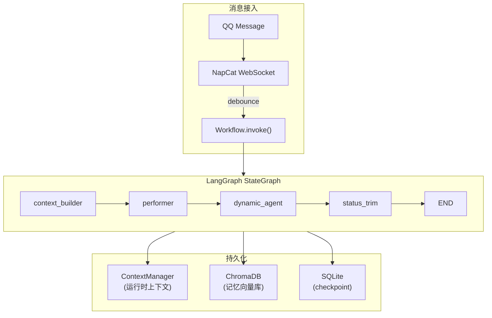
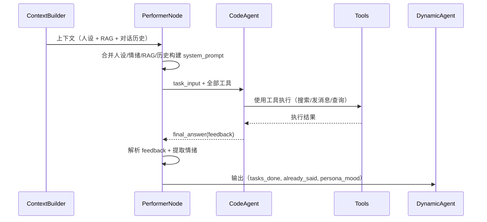
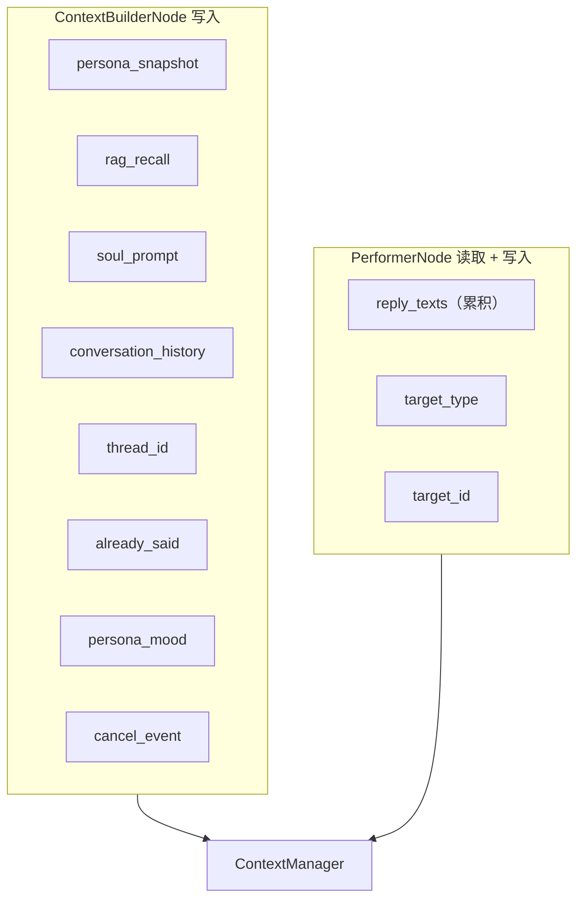
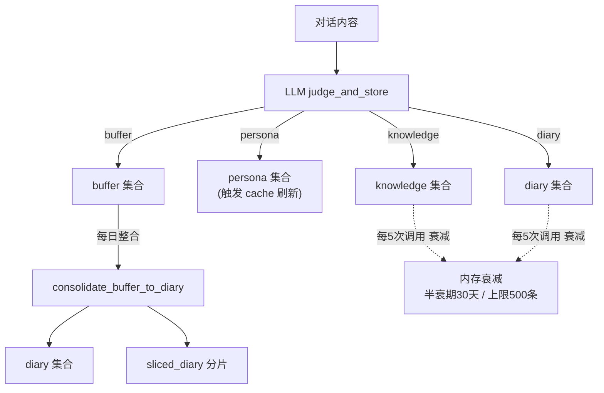
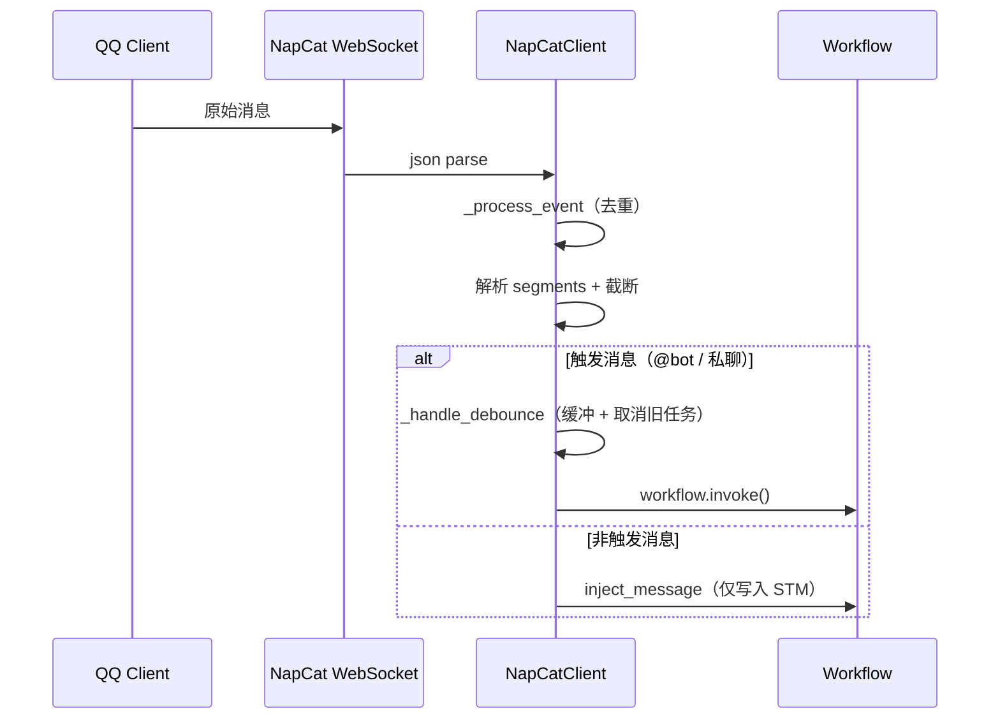

# Thinking - AI Agent 对话系统

基于 LangGraph 构建的 AI Agent 对话系统，通过 NapCat WebSocket 协议集成 QQ 聊天。

## 系统架构



## 核心特性

- **4 节点工作流管道**: context_builder → performer → dynamic_agent → status_trim
- **自治 Agent**: Performer 基于 smolagents CodeAgent 端到端处理用户请求
- **情绪系统**: 基于 arousal（0-100）的动态情绪状态，影响回复语气
- **记忆系统**: 5 个 ChromaDB 集合，支持 RAG 检索、记忆衰减和 buffer → diary 整合
- **人设系统**: 基于 SOUL.md 的动态人设，支持热重载
- **工具注册**: 动态工具注册机制，15 个内置工具（搜索、图片识别、QQ 消息操作）
- **模型管理**: 多 Provider 注册，懒加载模型缓存
- **Data Viewer**: Web 界面查看 LangGraph checkpoint 和 ChromaDB 记忆数据

## 快速开始

### 环境要求

- Python 3.11+
- NapCat QQ Bot 服务端
- LLM Provider API Key（DeepSeek、MIMO 等）

### 安装

```bash
pip install -r requirements.txt
```

### 配置

复制 `thinking.env.example` 为 `thinking.env` 并填写配置：

```env
MODEL_LIST='["deepseek-v4-flash","deepseek-v4-pro","mimo-v2.5","mimo-v2.5-pro"]'
MODEL_SELECTED=deepseek-v4-flash

DEEPSEEK_API_URL=https://api.deepseek.com
DEEPSEEK_API_KEY=sk-your-key

MIMO_API_URL=https://token-plan-sgp.xiaomimimo.com/v1
MIMO_API_KEY=sk-your-key

RAG_EMBEDDING_MODEL=BAAI/bge-small-zh-v1.5
RAG_PERSIST_DIR=memory_data/chroma_db

NAPCAT_WS_SERVER=ws://localhost:9998
NAPCAT_WS_TOKEN=your-token
BOT_NUMBER=your-bot-qq-number

VISUAL_RECOGNITION_API_KEY=sk-your-key
VISUAL_RECOGNITION_API_URL=https://api.example.com/v1
VISUAL_RECOGNITION_MODEL=model-name

WORKFLOW_TIMEOUT_SECONDS=120.0
LLM_REQUEST_TIMEOUT_SECONDS=30.0
LLM_MAX_RETRIES=1
DEBOUNCE_SECONDS=3.0
MAX_INPUT_LENGTH=4096
```

### 运行

```bash
python main.py
```

### Data Viewer

```bash
python -m data_viewer                    # 默认 8501 端口
python -m data_viewer --port 9000         # 自定义端口
python -m data_viewer --host 0.0.0.0     # 允许外部访问
```

## 项目结构

```
thinking/
├── main.py                         # 入口：asyncio 事件循环 + NapCat 连接
├── thinking_settings.py            # Pydantic Settings 配置
├── thinking.env                    # 环境变量（不入库）
│
├── Personal/
│   └── SOUL.md                     # AI 人设定义（热重载）
│
├── workflow/                       # LangGraph 工作流
│   ├── workflow.py                 # StateGraph 编译 + Workflow.invoke()
│   ├── context_manager.py          # 运行时上下文管理器（线程安全）
│   ├── cancel.py                   # 取消事件管理
│   ├── status/
│   │   ├── graph_status.py         # GraphStatus TypedDict + 状态合并函数
│   │   └── manager_route.py        # TaskItem 模型
│   └── nodes/
│       ├── context_builder_node.py # 加载人设、RAG、构建上下文
│       ├── performer_node.py       # CodeAgent 端到端处理请求
│       ├── dynamic_agent_node.py   # 记忆写入、buffer 整合、衰减
│       └── status_trim_node.py     # 消息窗口裁剪 + 状态重置
│
├── memory/                         # 记忆系统
│   ├── persona_state.py            # PersonaState / PersonaCache / PersonaMood
│   ├── store_interface.py          # MemoryStore 协议接口
│   ├── vector_store/               # ChromaDB 封装（5 个 collection）
│   ├── retrieval/                  # 场景化 RAG 检索
│   ├── consolidation/              # LLM judge 记忆分类存储
│   └── lifecycle/                  # buffer → diary 整合
│
├── napcat_server/                  # QQ 消息接入
│   ├── napcat_connection.py        # WebSocket + 消息队列 + debounce
│   └── global_client.py            # 全局 NapCatClient 实例
│
├── tools/                          # 工具系统
│   ├── tool_registry.py            # 动态工具注册
│   ├── performer_tools/
│   │   ├── webSearch.py            # 网页搜索
│   │   └── visualRecognition.py    # 图片识别
│   └── napcat_tools/
│       └── common_msgs/
│           ├── cmsg_tools.py       # send_msg（累积 reply_texts）
│           ├── msg_tools.py        # delete_msg / get_msg / forward 等
│           ├── group_tools.py      # 群信息查询
│           ├── interact_tools.py   # send_poke
│           ├── types.py            # Pydantic 消息模型
│           └── base.py             # 异步 API 调用封装
│
├── utils/                          # 工具库
│   ├── model_registry.py           # 模型 Provider 注册
│   ├── lazy_model.py               # 懒加载模型缓存
│   ├── generate_langchain_model.py # LangChain ChatOpenAI 创建
│   ├── generate_sml_model.py       # smolagents OpenAIModel 创建
│   ├── file_cache.py               # 文件热重载缓存
│   ├── time_utils.py               # day_key() 日期工具
│   └── observability.py            # MetricsCollector 性能指标
│
├── data_viewer/                    # 数据查看 Web 工具
│   ├── api.py                      # FastAPI 路由
│   ├── db.py                       # SQLite + ChromaDB 数据访问
│   └── __main__.py                 # CLI 启动入口
│
└── docs/                           # 文档
```

## 工作流详解

### 图结构


- **context_builder**: 加载 SOUL.md 人设、执行 RAG 检索获取记忆上下文、构建 Persona 快照、格式化对话历史，将所有上下文写入 ContextManager
- **performer**: 基于 smolagents CodeAgent 端到端处理用户请求。Agent 拥有全部工具（搜索、图片识别、QQ 消息操作），自主规划并执行。通过 send_msg 回复用户，通过 final_answer 返回任务反馈
- **dynamic_agent**: 收集本轮对话内容，调用 LLM judge 分类存储记忆（knowledge/persona/diary/buffer）；每日首次触发 buffer → diary 整合；定期执行记忆衰减
- **status_trim**: 清理临时状态（tasks_done, already_said 重置）；消息窗口超限时触发 LLM 摘要裁剪

### PerformerNode 执行流程



### ContextManager 数据流

`ContextManager` 是线程安全的运行时上下文容器，在每次 `Workflow.invoke()` 时重置：



### 状态合并策略

`GraphStatus` 使用自定义 reducer 管理状态合并：

| 字段 | 策略 | 说明 |
|------|------|------|
| `messages` | `_replaceable_add_messages` | 追加消息，支持 `__replace__` 替换 |
| `tasks_done` | `merge_tasks` | 按 agent_name 合并，去重 task_id |
| `already_said` | `add_list_str` | 追加（支持 RESET 清空） |
| `persona_mood` | 覆盖 | 最新情绪状态 |
| `diary_triggered_day` | 覆盖 | 最近触发日记的日期 |
| `invocation_count` | 覆盖 | 自增调用计数 |

## 记忆系统

| 集合 | 用途 | 来源 |
|------|------|------|
| `knowledge` | 稳定知识（技术事实、项目信息） | LLM judge 分类存储 |
| `persona` | 用户长期特征（偏好、习惯） | LLM judge 分类存储 |
| `diary` | 日记条目 | buffer 整合生成 |
| `sliced_diary` | 日记段落切片 | diary 自动切片 |
| `buffer` | 待整合的对话片段 | 每次对话后写入 |

### 记忆生命周期



**衰减机制**: 每 5 次调用触发，半衰期 30 天，基于重要性的指数衰减，每集合上限 500 条。

**RAG 检索**: 根据场景使用不同 k 值从 knowledge、persona、sliced_diary 中检索相关记忆。

## 工具系统

Performer 通过 `PERFORMER_TOOLS` 注册，共 15 个工具：

| 工具 | 模块 | 功能 |
|------|------|------|
| webSearch | `performer_tools/webSearch.py` | DuckDuckGo 网页搜索 |
| visualRecognition | `performer_tools/visualRecognition.py` | 图片内容识别 |
| send_msg | `napcat_tools/common_msgs/cmsg_tools.py` | 发送 QQ 消息 |
| delete_msg | `napcat_tools/common_msgs/msg_tools.py` | 撤回 QQ 消息 |
| get_msg | `napcat_tools/common_msgs/msg_tools.py` | 获取消息详情 |
| send_forward_msg | `napcat_tools/common_msgs/msg_tools.py` | 发送合并转发 |
| send_group_forward_msg | `napcat_tools/common_msgs/msg_tools.py` | 群合并转发 |
| send_private_forward_msg | `napcat_tools/common_msgs/msg_tools.py` | 私聊合并转发 |
| get_group_msg_history | `napcat_tools/common_msgs/msg_tools.py` | 群历史消息 |
| get_friend_msg_history | `napcat_tools/common_msgs/msg_tools.py` | 私聊历史消息 |
| get_group_list | `napcat_tools/common_msgs/group_tools.py` | 群列表 |
| get_group_info | `napcat_tools/common_msgs/group_tools.py` | 群详细信息 |
| get_group_member_list | `napcat_tools/common_msgs/group_tools.py` | 群成员列表 |
| get_group_member_info | `napcat_tools/common_msgs/group_tools.py` | 群成员信息 |
| send_poke | `napcat_tools/common_msgs/interact_tools.py` | 戳一戳 |

### send_msg 工具

```python
send_msg(msg={
    "message_type": "private",  # 或 "group"
    "user_id": "123456",        # 私聊时填写
    "group_id": "789012",       # 群聊时填写
    "message": [
        {"type": "text", "data": {"text": "消息内容"}}
    ]
})
```

发送成功后自动将文本追加到 `ctx.reply_texts`，最终作为 AIMessage 写入 checkpoint。

## NapCat QQ 集成

### 消息流



### 连接管理

- 指数退避 + jitter 重连
- 独立 `_process_loop` 消费 `asyncio.Queue`
- API 调用超时 + 连接等待
- 消息去重（最近 1000 条 message_id）
- debounce 冷却（默认 3.0s，可配置）

## 扩展指南

### 添加模型 Provider

```python
from utils import get_model_registry, ModelProvider

registry = get_model_registry()
registry.register(ModelProvider(
    name="openai",
    base_url="https://api.openai.com/v1",
    api_key="sk-your-key",
    models=["gpt-4o", "gpt-4o-mini"],
))
```

### 添加新工具

```python
from tools import get_tool_registry, PERFORMER_TOOLS

registry = get_tool_registry()
registry.register_tool(PERFORMER_TOOLS, my_tool, authorized_imports=["json"])
```

### 自定义人设

编辑 `Personal/SOUL.md`，保存后自动热重载，无需重启。

## 文档

- [架构详解](docs/architecture.md)
- [开发环境配置](docs/dev_setup.md)
