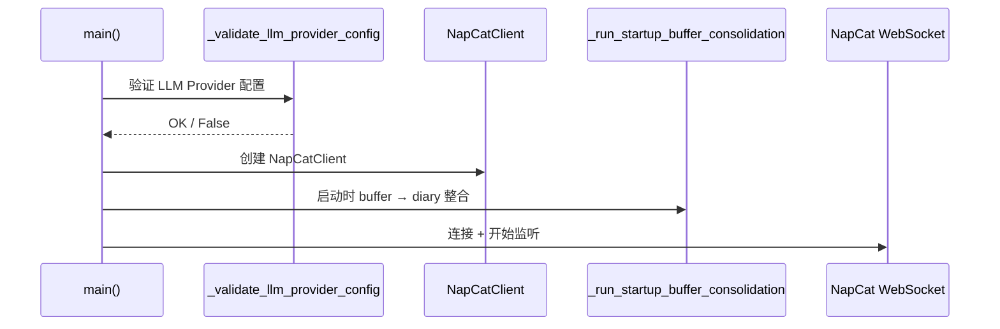

# Development Environment Setup

## Prerequisites

- Python 3.11+
- NapCat QQ Bot server running and accessible
- API keys for LLM providers (DeepSeek, MIMO, etc.)
- HuggingFace access (for embedding model download)

## Installation

```bash
cd thinking
pip install -r requirements.txt
```

## Configuration

Copy `thinking.env.example` to `thinking.env` and fill in your values:

```env
# Model Configuration
MODEL_LIST='["deepseek-v4-flash","deepseek-v4-pro","mimo-v2.5","mimo-v2.5-pro"]'
MODEL_SELECTED=deepseek-v4-flash

# Provider: DeepSeek
DEEPSEEK_API_URL=https://api.deepseek.com
DEEPSEEK_API_KEY=sk-your-deepseek-key

# Provider: MIMO
MIMO_API_URL=https://token-plan-sgp.xiaomimimo.com/v1
MIMO_API_KEY=sk-your-mimo-key

# RAG Embedding
RAG_EMBEDDING_MODEL=BAAI/bge-small-zh-v1.5
RAG_PERSIST_DIR=memory_data/chroma_db
HF_ENDPOINT=https://huggingface.co

# NapCat QQ Bot
NAPCAT_WS_SERVER=ws://localhost:9998
NAPCAT_WS_TOKEN=your-napcat-token
NAPCAT_WS_RECONNECT_TIMEOUT=5
NAPCAT_WS_API_RESPONSE_TIMEOUT=15
BOT_NUMBER=your-bot-qq-number

# Visual Recognition (optional)
VISUAL_RECOGNITION_API_KEY=sk-your-key
VISUAL_RECOGNITION_API_URL=https://api.example.com/v1
VISUAL_RECOGNITION_MODEL=model-name

# Workflow Settings
DEBOUNCE_SECONDS=3.0
WORKFLOW_TIMEOUT_SECONDS=120.0
LLM_REQUEST_TIMEOUT_SECONDS=30.0
LLM_MAX_RETRIES=1
LLM_MAX_TOKENS=4096
MAX_INPUT_LENGTH=4096
DEDUP_THRESHOLD=0.08
DAY_KEY_CUTOFF_HOUR=4

# Retrieval Settings
RETRIEVAL_KNOWLEDGE_K=5
RETRIEVAL_PERSONA_K=4
RETRIEVAL_DIARY_K=2

# Data Viewer
VIEWER_PORT=8501
```

## Running

```bash
python main.py
```

The system will connect to the NapCat WebSocket and begin listening for QQ messages.

### Startup Sequence



## Data Viewer

A web-based tool for inspecting LangGraph checkpoint data and ChromaDB memory collections:

```bash
# Start with default port (8501)
python -m data_viewer

# Custom port
python -m data_viewer --port 9000

# Custom database path
python -m data_viewer --db-path /path/to/checkpoints.db

# Custom ChromaDB path
python -m data_viewer --chroma-path /path/to/chroma_db

# Custom host (allow external access)
python -m data_viewer --host 0.0.0.0
```

Then open `http://127.0.0.1:8501` in your browser.

### Configuration

Add to `thinking.env` to customize the default port:

```env
VIEWER_PORT=8501
```

### Features

- Browse all thread_ids with checkpoint counts
- View checkpoint timeline with step numbers and source
- Inspect deserialized GraphStatus (messages, tasks_done, persona_mood)
- Browse ChromaDB collections (knowledge, persona, diary, sliced_diary, buffer)
- Search/filter thread_ids and collection contents
- Read-only database access (no data modification)

## Architecture Overview

### Workflow Pipeline


### Memory Collections

| Collection | Storage Pattern | Purpose |
|------|------|------|
| `knowledge` | Direct write via judge | Stable reusable knowledge |
| `persona` | Direct write + cache invalidation | User long-term traits |
| `diary` | Consolidation from buffer | Daily diary entries |
| `sliced_diary` | Auto-sliced from diary | Granular retrieval |
| `buffer` | Ongoing write, daily clear | Pre-consolidation fragments |

### Key Components

| Component | Module | Pattern |
|------|------|------|
| Model Creation | `utils/generate_langchain_model.py` | Factory + registry |
| Model Caching | `utils/lazy_model.py` | Thread-safe lazy init |
| Tool Registry | `tools/tool_registry.py` | Dynamic discovery |
| Persona Cache | `memory/persona_state.py` | Hot-reload via mtime |
| Context Sharing | `workflow/context_manager.py` | Per-invocation dict |
| Memory Store | `memory/vector_store/chroma_store.py` | Singleton ChromaDB |

## Adding a New Model Provider

1. Register the provider programmatically:

```python
from utils import get_model_registry, ModelProvider

registry = get_model_registry()
registry.register(ModelProvider(
    name="openai",
    base_url="https://api.openai.com/v1",
    api_key="sk-your-key",
    models=["gpt-4o", "gpt-4o-mini"],
))
```

2. Or add environment variables in `thinking.env` and update `register_default_providers()` in `utils/model_registry.py`.

## Adding a New Tool

Tools are registered through `ToolRegistry` in the `PERFORMER_TOOLS` category:

```python
from tools import get_tool_registry, PERFORMER_TOOLS

@tool
def my_tool(query: str) -> str:
    """Description of what this tool does."""
    return result

registry = get_tool_registry()
registry.register_tool(PERFORMER_TOOLS, my_tool, authorized_imports=["json"])
```

The tool will be automatically discovered and available to the Performer CodeAgent.

## Customizing Persona

Edit `Personal/SOUL.md` to define the AI character. Changes are detected via file modification time and hot-reloaded automatically via `FileCache` in `utils/file_cache.py`.

### Persona Structure

The persona system uses three components defined in `memory/persona_state.py`:

- **PersonaState**: User profile data (name, habits, preferences, tech_stack)
- **PersonaCache**: Thread-safe cache with version tracking for hot-reload
- **PersonaMood**: Emotion state (arousal 0-100, consecutive_triggers)

## Testing Persona Changes

The SOUL file is cached with mtime-based invalidation. After editing:
1. Save `Personal/SOUL.md`
2. The next message will automatically use the updated persona
3. No restart required

## Project Structure Pattern

When adding new modules, follow these conventions:
- Use `from __future__ import annotations` in all files
- Use `LazyLangChainModel`/`LazySmolModel` from `utils.lazy_model` instead of direct model creation
- Register tools through `ToolRegistry` in `register_default_tools()`
- Add error handling with logging for all node functions
- Use `persona_cache` from `memory.persona_state` for persona reads
- Use `file_cache` from `utils.file_cache` for file reads needing hot-reload
- Use `ContextManager` via `get_context_manager()` for cross-node data sharing

## Troubleshooting

### NapCat Connection Failed
- Verify `NAPCAT_WS_SERVER` and `NAPCAT_WS_TOKEN` are correct
- Ensure NapCat WebSocket server is running
- Check firewall/network settings

### Model API Errors
- Verify API keys are valid and have sufficient quota
- Check `MODEL_SELECTED` is registered in `ModelProviderRegistry`
- Ensure API URLs end with `/v1` for OpenAI-compatible providers
- Run with `logging.basicConfig(level=logging.DEBUG)` for detailed logs

### ChromaDB Issues
- Delete `memory_data/chroma_db` to reset the vector store
- Ensure HuggingFace endpoint is accessible for embedding model download
- Set `HF_ENDPOINT` to a mirror if the default is blocked

### Workflow Timeout
- Increase `WORKFLOW_TIMEOUT_SECONDS` in `thinking.env`
- Check logs for specific node execution errors
- Increase `LLM_REQUEST_TIMEOUT_SECONDS` if LLM responses are slow

### Memory Issues
- Set `DEDUP_THRESHOLD` higher to allow more similar entries
- Reduce `DECAY_MAX_ENTRIES` (in `memory/vector_store/chroma_store.py`) to limit collection size
- Check `LLM_MAX_TOKENS` is sufficient for long conversations
